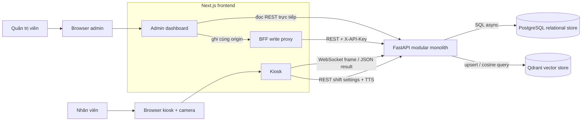
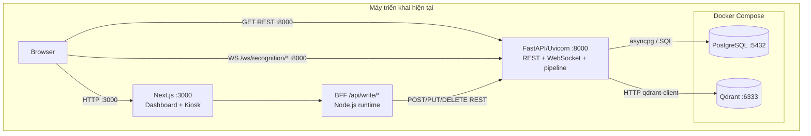
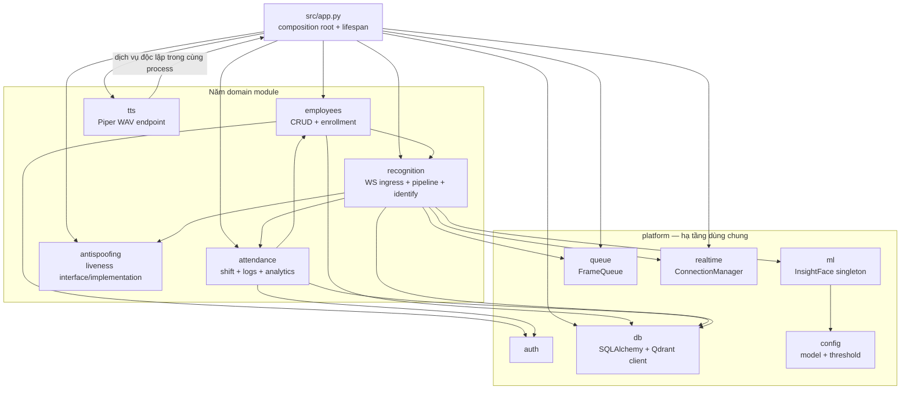

# Chương 2. Kiến trúc hệ thống

## 2.1. Quan điểm kiến trúc

FaceVec Attend gồm hai ứng dụng người dùng trên cùng frontend Next.js — **admin dashboard** và **kiosk** — kết nối đến một backend FastAPI. Backend là **modular monolith**: các domain được tách thành package, nhưng được import, khởi tạo và chạy trong cùng tiến trình, cùng app lifecycle và cùng đơn vị triển khai. PostgreSQL là **relational store**; Qdrant là **vector store**. Hai kho có trách nhiệm khác nhau và không tạo thành hai microservice nghiệp vụ.

## 2.2. System context

Quản trị viên không truy cập cơ sở dữ liệu trực tiếp; dashboard đọc FastAPI và dùng BFF cho các thao tác ghi được allowlist. Nhân viên tương tác với camera kiosk; browser gửi frame cho backend và nhận kết quả để cập nhật giao diện/phát TTS. FastAPI là điểm phối hợp nghiệp vụ duy nhất giữa PostgreSQL và Qdrant.

## 2.3. Deployment và giao thức

Ở cấu hình khảo sát, Compose chỉ chạy PostgreSQL và Qdrant; các port `5432` và `6333` được bind vào loopback host. Next.js nghe ở `3000`, FastAPI thường chạy ở `8000`. Browser dashboard đọc REST trực tiếp từ backend; browser kiosk dùng cả REST và WebSocket. BFF nằm trong server runtime của Next.js, chỉ chuyển tiếp `POST`, `PUT`, `DELETE` đến đích được phép và gắn API key phía server.

Đây là sơ đồ deployment/component logic, không phải cam kết topology production. TLS, reverse proxy, process supervisor và multi-host orchestration chưa được thể hiện bởi `compose.yaml` hiện tại.

## 2.4. Cấu trúc module backend

`src/app.py` là composition root: tạo queue/connection manager, kiểm tra liveness khi khởi động production, bảo đảm Qdrant collection tồn tại, chạy background recognition pipeline và gắn router. `platform` cung cấp hạ tầng dùng chung, không phải một domain nghiệp vụ. Năm domain là `employees`, `attendance`, `recognition`, `antispoofing` và `tts`; chúng gọi nhau bằng import/hàm Python trực tiếp, không qua network.

Một số phụ thuộc đáng chú ý:

- `employees` gọi extractor của `recognition` để tạo embedding khi enrollment, rồi ghi PostgreSQL và Qdrant;
- `recognition` dùng `antispoofing`, vector search và gọi `attendance.log_attendance` sau khi xác định được nhân viên;
- `attendance` dùng model/service nhân viên để kiểm tra và thống kê;
- `tts` có router/service riêng nhưng vẫn nằm trong cùng app và process FastAPI.

## 2.5. Recognition pipeline như một thành phần kiến trúc

Pipeline realtime được khởi tạo một lần trong FastAPI lifespan:

1. WebSocket ingress nhận binary JPEG theo `client_id`.
2. `FrameQueue(maxsize=50)` áp dụng drop-oldest khi đầy để ưu tiên tín hiệu mới.
3. Pipeline giới hạn số tác vụ đang xử lý bằng semaphore và thread pool bốn worker.
4. Worker decode frame, chọn khuôn mặt lớn nhất, kiểm tra liveness và lấy embedding.
5. Qdrant trả ứng viên top-1 theo ngưỡng cosine của implementation.
6. Nếu nhận diện thành công, service attendance kiểm tra ca và ghi PostgreSQL.
7. `ConnectionManager` trả JSON status về đúng WebSocket client; kiosk chuyển status thành giao diện và phản hồi âm thanh.

Pipeline là một background task bên trong modular monolith, không phải recognition microservice hay message-queue worker độc lập. Queue hiện là `asyncio.Queue` trong bộ nhớ, nên trạng thái không được chia sẻ giữa nhiều process FastAPI.

## 2.6. Vai trò của PostgreSQL và Qdrant

| Kho | Dữ liệu | Trách nhiệm | Không đảm nhiệm |
|---|---|---|---|
| PostgreSQL | Nhân viên, ca làm, nhật ký, thời lượng làm việc | Quan hệ, khóa ngoại, transaction nghiệp vụ và truy vấn thống kê | Không lưu embedding trong thiết kế hiện tại |
| Qdrant | Nhiều point embedding cho mỗi nhân viên, kèm payload định danh | Tìm kiếm vector 512 chiều theo cosine | Không là nguồn sự thật cho ca hoặc nhật ký chấm công |

Backend giữ liên kết logic bằng `emp_id` trong payload Qdrant. Không có foreign key vật lý hay transaction chung giữa hai kho. Luồng đăng ký commit PostgreSQL trước khi upsert Qdrant; luồng xóa xóa vector trước khi xóa bản ghi PostgreSQL. Vì vậy vận hành thực tế cần quan sát và cơ chế reconciliation cho các failure window, thay vì giả định tính nguyên tử xuyên hai kho.

## 2.7. Vì sao là modular monolith

Hệ thống đáp ứng các dấu hiệu của modular monolith:

- một app FastAPI và một composition root gắn toàn bộ router;
- một lifecycle khởi động/dừng cho DB clients và recognition task;
- các domain được tổ chức thành package nhưng giao tiếp bằng lời gọi nội bộ;
- một đơn vị backend được build, chạy và scale cùng nhau;
- queue, connection registry, model singleton và pipeline cùng nằm trong bộ nhớ tiến trình.

Việc dùng PostgreSQL, Qdrant và Next.js không biến backend thành microservice. Database là hạ tầng lưu trữ; frontend/BFF là lớp trình bày và biên bảo vệ secret. Một microservice architecture thường đòi hỏi các service nghiệp vụ triển khai độc lập, hợp đồng network rõ, sở hữu dữ liệu và cơ chế xử lý lỗi phân tán — các đặc điểm đó không phải hiện trạng của năm module Python.

## 2.8. So sánh với microservice

| Tiêu chí | Modular monolith hiện tại | Microservice (phương án khác) |
|---|---|---|
| Triển khai | Một backend unit | Nhiều service triển khai độc lập |
| Giao tiếp domain | Hàm/import Python | REST/gRPC/event qua network |
| Transaction nghiệp vụ | Đơn giản trong PostgreSQL; riêng Qdrant vẫn cần bù trừ | Thường cần saga/outbox/idempotency xuyên service |
| Vận hành | Ít process, dễ debug và phù hợp quy mô đồ án | Tăng nhu cầu discovery, tracing, orchestration và quản trị schema |
| Scale | Scale toàn backend cùng nhau | Có thể scale riêng workload nóng |
| Cô lập lỗi | Hạn chế hơn vì chung process | Tốt hơn nếu biên và cơ chế phục hồi được thiết kế đúng |

Với phạm vi hiện tại, modular monolith giảm chi phí vận hành trong khi vẫn giữ ranh giới code đủ rõ. Chuyển sớm sang microservice sẽ thêm network failure, quan sát phân tán và nhất quán dữ liệu trước khi có số đo chứng minh nhu cầu.

## 2.9. Ranh giới có thể tách trong tương lai

Các ranh giới sau là **đề xuất tương lai**, không mô tả hệ thống hiện hành:

- **Recognition worker** có thể tách khi benchmark cho thấy CPU/GPU inference cần scale độc lập; khi đó cần broker/queue bền vững, correlation ID và contract kết quả.
- **TTS service** có thể tách nếu tải tổng hợp âm thanh ảnh hưởng event loop hoặc cần cache/model deployment riêng.
- **Reporting/analytics worker** có thể tách khi truy vấn báo cáo dài ảnh hưởng giao dịch chấm công.
- **Identity/access service** có thể bổ sung để cung cấp login, RBAC và audit thay cho API key chia sẻ.

Điều kiện hợp lý để tách là có bằng chứng về tải, nhịp phát hành, ownership hoặc yêu cầu cô lập lỗi. Trước đó, nên củng cố interface nội bộ, observability, reconciliation PostgreSQL–Qdrant và kiểm thử hợp đồng ngay trong modular monolith.

## 2.10. Kết luận chương

Kiến trúc hiện tại kết hợp Next.js dashboard/kiosk, BFF, một FastAPI modular monolith và hai kho dữ liệu chuyên biệt. Ba sơ đồ trên xác định rõ actor, giao thức, deployment và phụ thuộc module. Cách gọi nhất quán này là nền tảng để các chương sau mô tả luồng, AI, API và frontend mà không nhầm thiết kế tương lai với trạng thái đã triển khai.

---

[Về mục lục](README.md) · [Trước: Chương 1 — Tổng quan dự án](01-tong-quan-du-an.md) · [Tiếp: Chương 3 — Luồng hoạt động](03-luong-hoat-dong.md)
