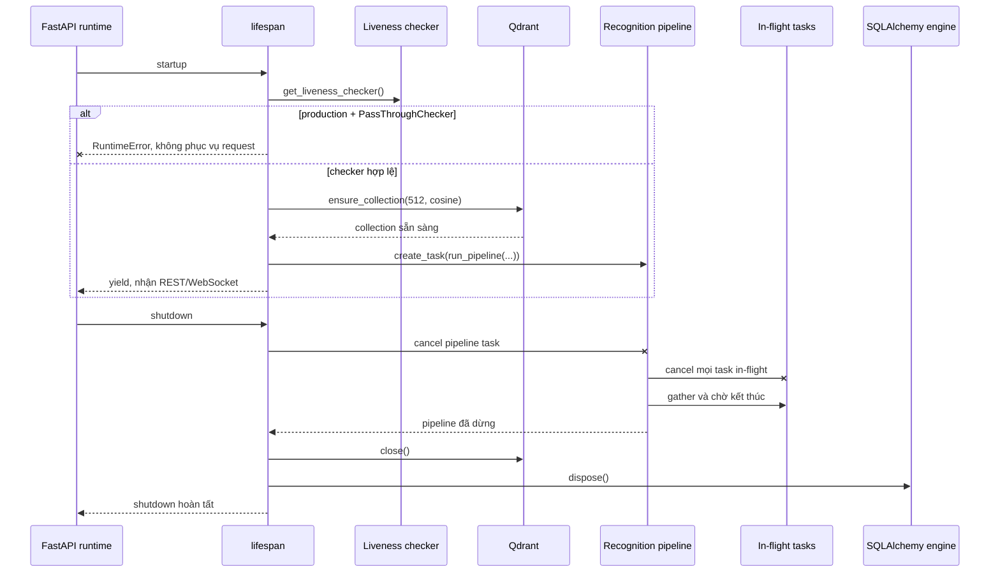
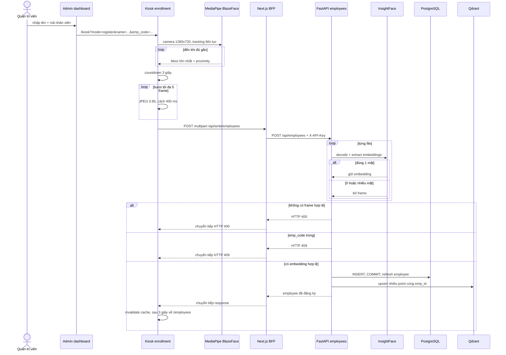
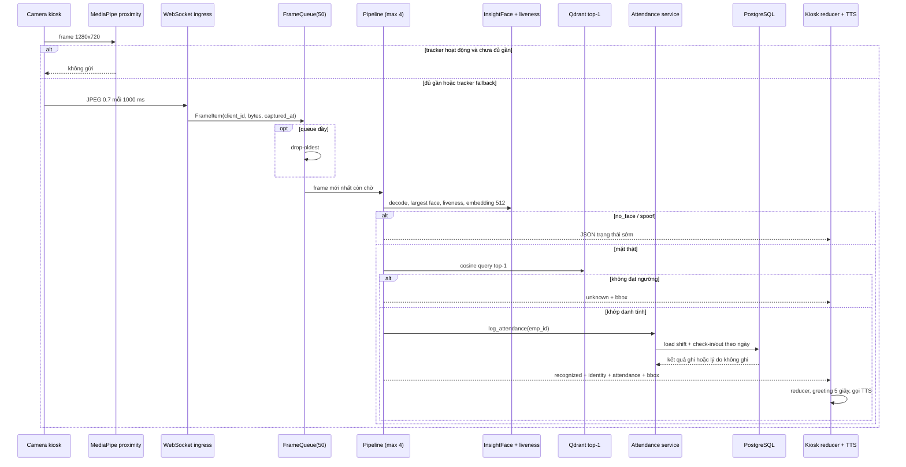

# Chương 3. Luồng hoạt động

## 3.1. Phạm vi chương

Chương này mô tả các đường đi tuần tự đang tồn tại trong code: vòng đời backend, đăng ký nhân viên nhiều frame, nhận diện và chấm công realtime, các thao tác quản trị và phản hồi TTS. Tên thành phần tuân theo Chương 2: Next.js cung cấp **admin dashboard**, **kiosk** và **BFF**; FastAPI là **modular monolith**; PostgreSQL là **relational store** và Qdrant là **vector store**.

Các sơ đồ biểu diễn thứ tự phối hợp, không phải số đo độ trễ hay cam kết tải. Những bước ghi qua PostgreSQL và Qdrant không nằm trong một transaction phân tán; các failure window liên quan được nêu rõ thay vì giả định tính nguyên tử.

## 3.2. Khởi động, phục vụ và dừng backend

`create_app()` tạo một `FrameQueue(maxsize=50)` và một `ConnectionManager` dùng chung cho process. Khi FastAPI đi vào lifespan, backend thực hiện tuần tự:

1. Lấy liveness checker. Nếu `ENV=production` mà checker là `PassThroughChecker`, tiến trình dừng bằng `RuntimeError`; production không được chạy với cơ chế luôn chấp nhận liveness.
2. Gọi `ensure_collection()`: đọc danh sách collection Qdrant và tạo `face_embeddings` với vector 512 chiều, khoảng cách cosine nếu collection chưa tồn tại.
3. Lấy Qdrant client và tạo một background task chạy recognition pipeline với queue, database session factory, connection manager, liveness checker và `THRESHOLD` hiện hành.
4. Sau khi lifespan `yield`, app nhận REST request và WebSocket. Frame WebSocket được đưa vào queue; pipeline lấy frame và tạo tối đa bốn tác vụ xử lý đồng thời.
5. Khi shutdown, app cancel pipeline task và chờ task đó kết thúc. Khối `finally` của pipeline cancel toàn bộ child task còn in-flight rồi `gather(..., return_exceptions=True)` để chờ chúng kết thúc và thu hồi semaphore permit.
6. Chỉ sau khi pipeline đã dừng, app đóng Qdrant client rồi `dispose()` SQLAlchemy engine, kể cả khi bước đóng Qdrant phát sinh lỗi.

Ở đây, “drain in-flight work” có nghĩa là backend **cancel và await việc kết thúc** của các child task đã tạo; code không bảo đảm để từng inference/chấm công đang chạy hoàn tất tự nhiên trước shutdown. Queue trong bộ nhớ cũng không được lưu bền vững để xử lý lại sau khi process khởi động lại.

## 3.3. Đăng ký nhân viên multi-frame

### 3.3.1. Từ admin dashboard đến kiosk

Quản trị viên nhập `name` và `empCode` trên trang Employees. Form chỉ chuyển trang sau khi dữ liệu qua validation phía client; nó chưa tạo nhân viên ở bước này. `enrollmentUrl()` tạo deep-link `/kiosk?mode=register&name=...&emp_code=...`. Trang kiosk đọc query string và chọn màn hình `KioskEnrollment`; nếu thiếu tên hoặc mã, giao diện yêu cầu quay lại trang Employees.

Kiosk xin camera trước với ràng buộc `facingMode: "user"`, kích thước mong muốn 1280×720. MediaPipe Tasks Vision chạy model BlazeFace short-range ở browser, thử GPU trước rồi CPU. Tracker chọn detection lớn nhất để vẽ khung và áp dụng proximity gate:

- bắt đầu coi là đủ gần khi diện tích bbox đạt ít nhất `0.12` diện tích frame;
- sau khi đã đủ gần, giữ trạng thái đến khi tỷ lệ xuống dưới `0.10` để tránh rung ngưỡng;
- giữ trạng thái tối đa 500 ms qua một khoảng mất detection ngắn.

MediaPipe chỉ điều khiển tracking, proximity và thời điểm chụp. Nó không trích embedding, không kiểm tra liveness và không quyết định danh tính.

### 3.3.2. Burst capture và ghi hai kho

Khi khuôn mặt đủ gần, kiosk đếm ngược từ 3, mỗi giây giảm một đơn vị. Mất proximity làm effect đếm dừng; state countdown hiện hành được giữ để một detection gap ngắn có thể tiếp tục thay vì luôn bắt đầu lại. Khi countdown về 0 và proximity vẫn `ok`, kiosk:

1. chụp frame đầu tiên ở độ phân giải video, mã hóa JPEG chất lượng `0.85`;
2. tiếp tục chụp mỗi 400 ms, mục tiêu tối đa 5 file JPEG không rỗng phía client (tính hợp lệ về số khuôn mặt vẫn do backend quyết định);
3. giới hạn tổng số lần thử ở 10, nên nếu có frame không tạo được thì vẫn gửi burst đã thu được, với điều kiện frame đầu tiên tồn tại;
4. ghép `name`, `emp_code` và từng file vào multipart field lặp lại tên `files`, rồi POST đến BFF `/api/write/employees`.

BFF chỉ chấp nhận target nằm trong allowlist, kiểm tra same-origin khi request có `Origin`, lấy secret phía server và gắn `X-API-Key` trước khi forward đến `POST /api/employees`. Mỗi file lớn hơn 5 MiB bị backend từ chối. Backend decode từng file, dùng InsightFace trích tất cả mặt, và **chỉ giữ frame có đúng một khuôn mặt**. Frame có 0 hoặc từ 2 mặt trở lên bị bỏ qua; cả request chỉ thất bại với HTTP 400 khi không còn embedding hợp lệ nào.

Service kiểm tra trùng `emp_code`, tạo employee và `flush()` để có `emp_id`, sau đó tạo một Qdrant point UUID cho mỗi embedding. PostgreSQL được commit và refresh **trước** khi upsert toàn bộ point sang Qdrant. Khi thành công, kiosk invalidate cache `employees` và `employee-name`, hiển thị thành công trong 3 giây rồi quay lại `/employees`.

### 3.3.3. Failure window của enrollment

PostgreSQL và Qdrant không có transaction chung. Nếu PostgreSQL commit thành công nhưng Qdrant upsert thất bại, API trả lỗi hệ thống nhưng employee đã tồn tại trong relational store và chưa có vector nhận diện. Retry cùng `emp_code` sau đó bị coi là trùng. Đây là trạng thái cần reconciliation/vận hành xử lý; không nên mô tả luồng ghi là nguyên tử.

## 3.4. Nhận diện và chấm công realtime

### 3.4.1. Thu camera và WebSocket ingress

Ở chế độ chấm công, kiosk cũng xin camera 1280×720. MediaPipe tracking/proximity chạy độc lập trên mỗi animation frame. Khi tracker hoạt động, chỉ khuôn mặt đủ gần mới cho phép capture; nếu tracker không khởi tạo hoặc inference thất bại, kiosk fallback sang gửi frame theo nhịp cũ và có thể vẽ bbox do backend trả về.

`useRecognition` duy trì một `client_id`: query parameter `client_id` được ưu tiên, nếu không có thì dùng UUID lưu trong `localStorage`. Browser mở `/ws/recognition/{client_id}`, tự reconnect sau 2000 ms khi kết nối đóng, và khi camera/socket sẵn sàng mà không hiển thị greeting sẽ:

- chụp toàn bộ frame video;
- mã hóa JPEG chất lượng `0.7`;
- gửi binary WebSocket mỗi 1000 ms.

Ingress đóng gói bytes, `client_id` và `captured_at` thành `FrameItem`. `FrameQueue` có capacity 50; khi đầy, nó lấy bỏ item cũ nhất trước khi thêm item mới (**drop-oldest**) để ưu tiên độ mới của tín hiệu realtime.

### 3.4.2. Từ frame đến attendance result

Pipeline chỉ cho tối đa bốn `_process` task in-flight, tương ứng thread pool bốn worker. Mỗi task thực hiện:

1. chuyển bytes thành mảng và decode JPEG bằng OpenCV; decode không tạo được ảnh được trả thành status `no_face`;
2. InsightFace phát hiện các mặt, chọn mặt có bbox lớn nhất và lấy normed embedding 512 chiều; không có mặt cũng trả `no_face`;
3. chạy liveness trên bbox đã chọn; không đạt trả `spoof`;
4. query Qdrant top-1 theo cosine và ngưỡng implementation; không có hit đạt ngưỡng trả `unknown` kèm bbox;
5. với hit hợp lệ, lấy `emp_id`/`name` từ payload, mở SQLAlchemy session và gọi `log_attendance()`;
6. service đọc shift settings từ PostgreSQL (hoặc dùng mặc định 08:00–10:00 và 17:00–19:00 khi chưa có record), quy đổi thời gian theo `Asia/Ho_Chi_Minh`, rồi chọn check-in, check-out hoặc ngoài khung giờ;
7. trả status `recognized` cùng danh tính, chuỗi kết quả attendance, bbox và timestamp. Mọi exception ngoài các nhánh đã phân loại được log ở server và trả `error` với detail chung `Lỗi hệ thống`.

Status `recognized` xác nhận danh tính đã khớp; nó **không nhất thiết đồng nghĩa vừa ghi mới một log**. Trường `attendance` có thể là `Check in successful`, `Check out successful`, `Already checked in`, `Check in not found to check out`, `Not during working hours` hoặc lỗi service đã được làm mờ. Check-in chỉ xét log chưa checkout của đúng ngày làm việc; check-out chỉ đóng log chưa checkout mới nhất của cùng ngày.

## 3.5. State reducer và phản hồi người dùng

Kiosk giữ camera state, socket state, greeting, hint và bbox riêng, rồi suy ra phase ưu tiên theo thứ tự: `camera_error` → `recognized` → `initializing` → `disconnected` → `scanning`. Reducer xử lý message như sau:

- `recognized`: tạo greeting chứa tên, bản dịch chuỗi attendance và loại check-in/check-out; giữ bbox; capture tạm dừng trong 5 giây;
- `unknown`: hiển thị “Không tìm thấy khuôn mặt” và bbox backend;
- `no_face`: xóa hint và bbox;
- `spoof`: xóa hint và bbox; implementation hiện không hiện cảnh báo spoof riêng;
- `error`: hiện “Hệ thống đang bận, thử lại sau giây lát” và xóa bbox.

Trong lúc greeting đang hiển thị, reducer bỏ qua message in-flight để một kết quả cũ không ghi đè lời chào. Mất camera tạo overlay yêu cầu cấp quyền/tải lại; socket đóng tạo overlay “Mất kết nối máy chủ” trong lúc tự reconnect.

## 3.6. Các flow quản trị còn lại

### 3.6.1. Danh sách, tìm kiếm và xóa nhân viên

- **Danh sách:** dashboard gọi `GET /api/employees?page=...&page_size=...`; backend đếm tổng, sắp theo `emp_id`, phân trang tối đa 100 bản ghi mỗi trang.
- **Tìm kiếm:** chuỗi tìm kiếm được đưa vào `GET /api/employees/{identifier}`. Identifier toàn chữ số được hiểu là `emp_id`; trường hợp khác tìm `name ILIKE '%...%'` và trả danh sách.
- **Xóa:** sau xác nhận, dashboard gọi BFF `DELETE /api/write/employees?emp_id=...` (hoặc `emp_code`). Backend tìm employee, xóa toàn bộ point Qdrant có payload `emp_id` tương ứng **trước**, rồi xóa employee và commit PostgreSQL. Relationship ORM và foreign key `ON DELETE CASCADE` làm attendance log của nhân viên bị xóa theo.

Thứ tự xóa cũng có failure window: nếu Qdrant delete thành công nhưng PostgreSQL delete/commit thất bại, employee và attendance vẫn còn trong relational store nhưng vector đã mất. Backend rollback SQL không thể khôi phục point Qdrant.

### 3.6.2. Cập nhật ca

Dashboard đọc `GET /api/shift-settings`; nếu bảng chưa có record, backend trả bộ mặc định. Khi lưu, client gửi `PUT /api/write/shift-settings`; BFF gắn API key và forward đến backend. Service update record đầu tiên hoặc insert mới rồi commit. Kiosk chấm công poll cấu hình mỗi 60 giây để cập nhật shift badge; attendance service luôn đọc cấu hình từ backend khi quyết định ghi log.

### 3.6.3. Summary, monthly, daily và Excel

Dashboard gọi ba endpoint đọc:

| Endpoint | Kết quả hiện hành |
|---|---|
| `GET /api/attendance/summary` | Tổng nhân viên; số lượt, giờ trung bình và tỷ lệ đúng giờ hôm nay; delta so với hôm qua, với delta `null` khi mẫu trước bằng 0 |
| `GET /api/attendance/monthly?year=...` | Các năm có dữ liệu; theo tháng gồm số attendance log, tổng giờ và giờ trung bình |
| `GET /api/attendance/daily?year=...&month=...` | Giờ làm trung bình theo từng ngày có dữ liệu trong tháng |

Nút Export trỏ trực tiếp đến `GET /api/attendance/report?year=...&month=...`. Backend tải danh sách nhân viên và log trong tháng, rồi OpenPyXL tạo workbook `.xlsx` gồm đúng hai sheet:

- `Summary`: mỗi nhân viên một dòng, kể cả chưa chấm công; gồm mã, tên, số ngày làm, tổng giờ và số lần muộn;
- `Detail`: mỗi attendance log một dòng; gồm mã, tên, ngày, giờ vào, giờ ra và số giờ.

Các truy vấn report hiện tải toàn bộ employee và log của tháng, không phân trang; comment implementation xác định giả định quy mô kiosk ở mức hàng trăm log/tháng, không phải benchmark hoặc giới hạn đã được đo.

## 3.7. Luồng TTS

TTS chỉ được kích hoạt phía kiosk khi nhận message `recognized`. Client chuyển chuỗi attendance kỹ thuật sang câu tiếng Việt rồi tạo text `Xin chào {name}. {kết quả}.`, gọi unauthenticated `GET /api/tts?text=...`. Endpoint giới hạn text từ 1 đến 200 ký tự và đưa hàm synthesize blocking sang `asyncio.to_thread()` để không chặn event loop.

Service lazy-load model Piper `vi_VN-vais1000-medium.onnx` một lần dưới thread lock, tổng hợp WAV trong bộ nhớ và trả `audio/wav`. Browser tạo object URL, phát bằng `Audio` và thu hồi URL khi kết thúc/lỗi. TTS là best-effort: lỗi fetch, synthesize response không thành công hoặc `audio.play()` bị browser từ chối không làm hỏng state chấm công.

## 3.8. Kết luận chương

Luồng chính của FaceVec Attend nối camera browser, proximity gate phía client, WebSocket queue trong bộ nhớ, recognition pipeline, Qdrant top-1, attendance service và PostgreSQL trước khi quay lại state reducer/TTS. Enrollment dùng multi-frame nhưng chỉ lưu embedding từ frame có đúng một mặt. Hai thứ tự ghi chéo kho được cố ý mô tả cùng failure window để chương dữ liệu và vận hành không suy diễn tính nguyên tử mà code hiện tại chưa cung cấp.

---

[Về mục lục](README.md) · [Trước: Chương 2 — Kiến trúc hệ thống](02-kien-truc-he-thong.md) · [Tiếp: Chương 4 — Xử lý AI và nhận diện](04-xu-ly-ai-va-nhan-dien.md)
