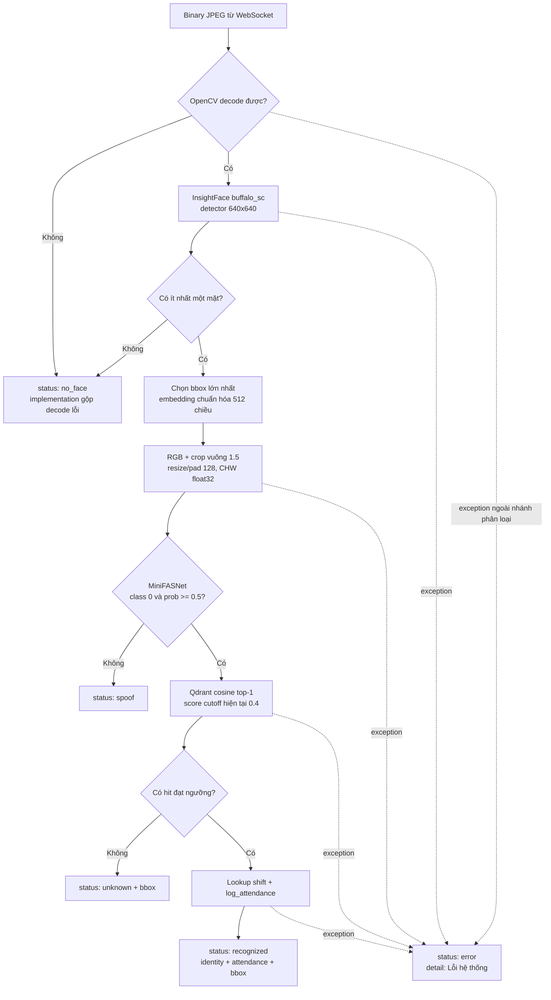

# Chương 4. Xử lý AI và nhận diện

## 4.1. Vai trò của ba lớp mô hình

Recognition pipeline hiện dùng ba lớp xử lý khuôn mặt có trách nhiệm khác nhau:

| Lớp | Nơi chạy | Vai trò | Không quyết định |
|---|---|---|---|
| MediaPipe Tasks Vision, BlazeFace short-range | Browser kiosk | Tracking bbox, chọn detection lớn nhất, proximity gate và thời điểm gửi/chụp | Danh tính, embedding backend, liveness và attendance |
| InsightFace `buffalo_sc` | Backend | Phát hiện mặt, chọn mặt lớn nhất, tạo normed embedding 512 chiều | Liveness và quy tắc ca làm |
| MiniFASNet ONNX | Backend | Phân loại crop của mặt được chọn là real/spoof | Nhân viên nào đang xuất hiện |

Sự phân công này quan trọng: bbox MediaPipe có thể giúp tránh gửi frame khi người đi ngang còn xa, nhưng backend vẫn phát hiện mặt lại bằng InsightFace và chỉ backend mới quyết định vector nào được query. Một proximity decision phía client không phải bằng chứng danh tính hoặc liveness.

## 4.2. InsightFace: phát hiện và embedding

`setup_face_app()` khởi tạo singleton `FaceAnalysis` thread-safe với cấu hình hiện tại:

- model pack: `buffalo_sc`;
- execution providers theo thứ tự: `CUDAExecutionProvider`, sau đó `CPUExecutionProvider`;
- `ctx_id = 0`;
- detector input size `640 × 640`;
- mỗi mặt cung cấp `normed_embedding`, được chuyển thành list 512 số thực.

Provider list thể hiện thứ tự ưu tiên cấu hình: ONNX Runtime/InsightFace có thể dùng CUDA khi khả dụng và CPU làm provider kế tiếp. Tài liệu không suy ra tốc độ hay tỷ lệ fallback từ danh sách này vì repository không kèm benchmark phần cứng.

### Enrollment

Với mỗi JPEG upload, OpenCV decode bytes thành ảnh BGR và `FaceAnalysis.get()` trả toàn bộ mặt. API chỉ nhận embedding của frame có đúng một mặt; một employee có thể có nhiều Qdrant point từ burst multi-frame. Ảnh đầu vào và crop không được ghi bền vững bởi flow này.

### Recognition realtime

Backend chạy `FaceAnalysis.get()` một lần cho frame và sắp face giảm dần theo diện tích bbox. Chỉ mặt lớn nhất — được hiểu như mặt gần camera nhất theo heuristic — đi tiếp. Bbox pixel được chuẩn hóa thành `[x1, y1, x2, y2]` trong khoảng 0..1 để client vẽ độc lập với kích thước hiển thị. Backend giữ `normed_embedding` của face này, chạy liveness bằng ảnh cùng bbox, rồi chỉ query embedding sang Qdrant nếu checker chấp nhận.

## 4.3. Qdrant cosine và ý nghĩa ngưỡng hiện tại

Collection `face_embeddings` dùng `VectorParams(size=512, distance=COSINE)`. Mỗi point enrollment có UUID riêng, vector embedding và payload `emp_id`, `emp_code`, `name`. Recognition gửi embedding hiện tại vào `query_points`, `limit=1`, `with_payload=True` để lấy ứng viên top-1.

Implementation truyền tham số như sau:

```text
THRESHOLD = 0.6
score_threshold = 1.0 - THRESHOLD = 0.4
accept nếu Qdrant có hit và hit.score >= 0.4
```

Vì vậy, điều kiện đang chạy là **cosine score tối thiểu 0.4**. Biến Python tên `THRESHOLD`/`threshold` được dùng như một phần bù khi tạo `score_threshold`; giá trị `0.6` tự nó không phải score cutoff trực tiếp. Nó cũng **không phải “độ chính xác 60%”**, không chứng minh xác suất đúng 60%, false accept rate, false reject rate hay accuracy của hệ thống.

Để diễn giải ngưỡng như chất lượng nhận diện cần một bộ dữ liệu có nhãn, protocol tách enrollment/query, phân bố score genuine/impostor và báo cáo metric tại cutoff. Repository hiện chỉ log cosine score của hit đã được chấp nhận để hỗ trợ tuning về sau; log đó chưa tạo thành benchmark.

Một chi tiết cần giữ khi cấu hình: nếu tăng biến `THRESHOLD` theo implementation hiện tại, `1 - THRESHOLD` giảm và điều kiện Qdrant trở nên **dễ chấp nhận hơn**; nếu giảm biến này, cutoff cosine tăng và điều kiện trở nên chặt hơn. Do tên biến dễ gợi cách hiểu ngược, mọi thay đổi cần kiểm thử bằng score distribution thay vì suy luận từ tên.

## 4.4. MiniFASNet anti-spoofing

`MiniFASNetChecker` nhận ảnh frame BGR và bbox chuẩn hóa của mặt lớn nhất. Preprocessing hiện hành:

1. đổi toàn frame từ BGR sang RGB;
2. đổi bbox chuẩn hóa về pixel;
3. lấy crop vuông có cạnh cơ sở `max(face_width, face_height)`, cùng tâm với bbox;
4. mở rộng cạnh theo `bbox_inc = 1.5`;
5. zero-pad phần crop vượt biên frame;
6. resize giữ tỷ lệ sao cho cạnh dài nhất bằng 128, rồi zero-pad thành `128 × 128`;
7. transpose HWC thành CHW, đổi `float32`, chia 255 về miền 0..1 và thêm batch dimension;
8. chạy ONNX Runtime bằng `CPUExecutionProvider`;
9. áp dụng softmax lên logits.

Model được hiểu theo contract code: **class 0 là mặt thật**. Checker chỉ trả `True` khi `argmax(probs) == 0` và `probs[0] >= threshold`. Threshold mặc định là `0.5`, có thể đổi bằng `ANTISPOOFING_THRESHOLD`. Đây là ngưỡng xác suất đầu ra class theo implementation, không phải accuracy 50% của model.

Model path mặc định là `models/antispoofing/AntiSpoofing_bin_1.5_128.onnx`, có thể đổi bằng `ANTISPOOFING_MODEL_PATH`. Nếu file không tồn tại, app dùng `PassThroughChecker`, nghĩa là mọi bbox phát hiện được đều qua liveness. Fallback này chỉ dành cho development: production guard từ chối khởi động nếu checker vẫn là `PassThroughChecker`.

## 4.5. Pipeline AI và các nhánh kết quả



Decode lỗi được implementation hiện tại ánh xạ thành `no_face`, không phải `error`. `error` dành cho exception rơi ra ngoài các nhánh có chủ đích, ví dụ lỗi inference, Qdrant, database hoặc gửi/xử lý liên quan trong `_process`. `ConnectionManager.send()` tự bỏ connection khỏi registry nếu gửi JSON thất bại; nó không tạo một message lỗi khác cho socket đã hỏng.

## 4.6. Hợp đồng trạng thái WebSocket và tác động UI

| Status | Payload backend hiện hành | Điều kiện tạo | Tác động reducer/UI kiosk |
|---|---|---|---|
| `no_face` | `{"status":"no_face","timestamp":"..."}` | JPEG decode thành `None` hoặc InsightFace không thấy mặt | Xóa hint và server bbox; tiếp tục phase scanning |
| `spoof` | `{"status":"spoof","timestamp":"..."}` | MiniFASNet/ checker trả `False` | Xóa hint và bbox; UI hiện không hiển thị cảnh báo spoof riêng |
| `unknown` | `{"status":"unknown","bbox":[x1,y1,x2,y2],"timestamp":"..."}` | Có mặt thật nhưng Qdrant không có top-1 đạt cutoff | Hiện “Không tìm thấy khuôn mặt”, giữ bbox để vẽ |
| `recognized` | `{"status":"recognized","emp_id":n,"name":"...","attendance":"...","bbox":[...],"timestamp":"..."}` | Qdrant khớp danh tính; attendance service đã trả kết quả | Tạo greeting, dịch chuỗi attendance, dừng capture 5 giây, phát TTS best-effort |
| `error` | `{"status":"error","detail":"Lỗi hệ thống"}` | Exception ngoài các nhánh có chủ đích | Hiện “Hệ thống đang bận, thử lại sau giây lát”, xóa bbox |

`timestamp` được tạo theo UTC ISO 8601 sau phần CPU work và được tái sử dụng trong message `unknown`/`recognized`; `error` hiện không có timestamp. `bbox` chỉ có ở `unknown` và `recognized`. Client contract là discriminated union tương ứng, vì vậy chương frontend có thể tham chiếu bảng này thay vì suy đoán field tùy chọn.

### Attendance không đổi recognition status

Sau khi Qdrant xác định người, pipeline luôn gửi `recognized` dù attendance service vừa ghi log, phát hiện đã check-in, không tìm thấy check-in để checkout, đang ngoài giờ hay trả lỗi được làm mờ. Ý nghĩa hai tầng là:

- `status` mô tả kết quả **nhận diện khuôn mặt**;
- `attendance` mô tả kết quả **quy tắc chấm công**.

Tách hai tầng giúp UI vẫn chào đúng người trong khi giải thích vì sao log không thay đổi. Nó cũng có nghĩa consumer không được dùng riêng `status == "recognized"` để kết luận một record attendance mới chắc chắn đã được commit.

## 4.7. MediaPipe proximity không phải lớp bảo mật

BlazeFace chạy hoàn toàn phía client với model asset self-hosted. Tracker thử GPU, fallback CPU; nếu cả init hoặc inference không hoạt động, code cố ý đặt `canCaptureRef=true` để recognition tiếp tục gửi frame và dùng bbox backend làm fallback. Vì client có thể lỗi hoặc bị thay đổi, proximity gate là tối ưu UX/tải, không phải boundary tin cậy.

Hai ngưỡng diện tích `0.12` và `0.10`, cùng grace 500 ms, là heuristic hình học theo kích thước bbox. Chúng không phải confidence threshold của nhận diện. Tương tự, lựa chọn detection lớn nhất ở MediaPipe giúp tracking nhất quán với heuristic “largest face” backend, nhưng backend vẫn tự phát hiện lại và không tin bbox client.

## 4.8. Giới hạn kiểm chứng và hướng đo đúng

### Đã có bằng chứng trong code

- embedding chuẩn hóa 512 chiều và Qdrant cosine;
- multi-frame enrollment, mỗi frame đúng một mặt tạo tối đa một point;
- largest-face selection cho realtime;
- liveness class 0 với threshold mặc định 0.5;
- cutoff cosine hiệu dụng 0.4 khi `THRESHOLD=0.6`;
- queue drop-oldest và tối đa bốn task xử lý đồng thời.

### Chưa được chứng minh

Repository không cung cấp kết quả đủ để khẳng định accuracy, FAR/FRR, ROC/AUC, tỷ lệ chống spoof, độ trễ percentile, throughput hay số kiosk đồng thời. Các hằng số model, queue và capture là cấu hình/heuristic đang chạy, không tự biến thành metric chất lượng.

Một đánh giá có thể tái lập nên tối thiểu tách dữ liệu enrollment khỏi query, giữ nhiều điều kiện ánh sáng/góc nhìn, có negative identities và spoof samples, rồi báo cáo confusion matrix cùng FAR/FRR tại từng cosine cutoff và liveness cutoff. Hiệu năng cần đo riêng thời gian decode, detection/embedding, anti-spoofing, Qdrant, PostgreSQL và end-to-end trên phần cứng triển khai mục tiêu. Đây là phương pháp đề xuất để đánh giá, không phải kết quả đã đạt.

## 4.9. Kết luận chương

Pipeline AI hiện kết hợp MediaPipe cho tracking/proximity phía browser, InsightFace `buffalo_sc` cho detection và normed embedding 512 chiều, MiniFASNet cho liveness, rồi Qdrant cosine top-1 cho danh tính. Điều kiện nhận diện hiệu dụng phải đọc từ biểu thức code: với `THRESHOLD=0.6`, hit cần score ít nhất `0.4`; con số này không phải accuracy. Bảng status phân biệt rõ kết quả AI, kết quả attendance và tác động UI để các chương dữ liệu/frontend dùng chung một contract.

---

[Về mục lục](README.md) · [Trước: Chương 3 — Luồng hoạt động](03-luong-hoat-dong.md) · [Tiếp: Chương 5 — Dữ liệu và API](05-du-lieu-va-api.md)
