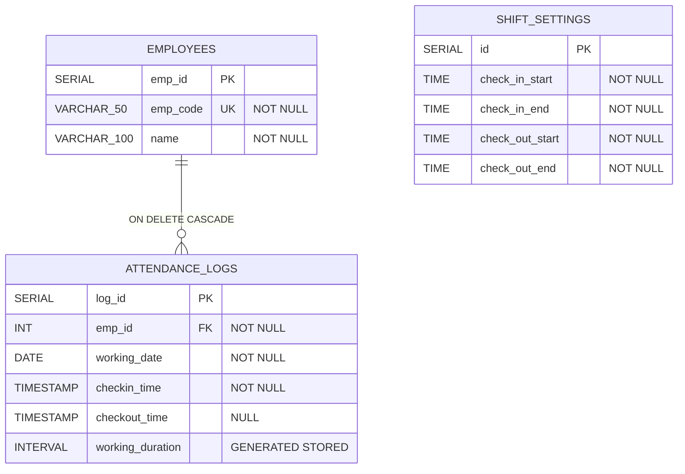
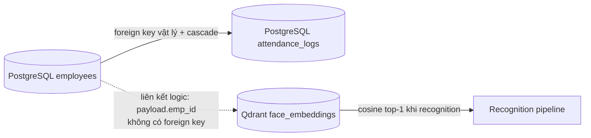

# Chương 5. Dữ liệu và API

## 5.1. Ranh giới dữ liệu

FaceVec Attend tách dữ liệu thành hai kho có trách nhiệm khác nhau:

- **PostgreSQL relational store** là nguồn sự thật cho nhân viên, cửa sổ ca và nhật ký chấm công;
- **Qdrant vector store** giữ embedding để tìm kiếm tương đồng, liên kết logic về nhân viên bằng `emp_id` trong payload.

Hai kho không có foreign key hoặc transaction phân tán chung. Vì vậy, `emp_id` trong Qdrant là một quy ước ứng dụng, không phải ràng buộc mà database tự thực thi.

## 5.2. Mô hình PostgreSQL

### 5.2.1. Bảng và ràng buộc

| Thành phần | Hợp đồng hiện hành |
|---|---|
| `employees` | `emp_id` tự tăng là khóa chính; `emp_code` duy nhất, tối đa 50 ký tự; `name` bắt buộc, tối đa 100 ký tự. |
| `attendance_logs` | Mỗi log thuộc một `emp_id`, một `working_date`; có giờ vào bắt buộc, giờ ra có thể rỗng. |
| Foreign key | `attendance_logs.emp_id → employees.emp_id ON DELETE CASCADE`; xóa nhân viên cũng xóa log của họ. ORM còn khai báo `cascade="all, delete-orphan"`. |
| `working_duration` | Cột `INTERVAL GENERATED ALWAYS AS (checkout_time - checkin_time) STORED`; SQLAlchemy dùng `Computed(..., persisted=True)` để không gửi giá trị vào `INSERT`/`UPDATE`. Khi chưa checkout, giá trị là `NULL`. |
| Check constraint | `valid_attendance_time` chỉ chấp nhận `checkout_time IS NULL` hoặc `checkout_time > checkin_time`. |
| Index thường | `(emp_id, working_date)` hỗ trợ truy vấn log của một nhân viên theo ngày. |
| Partial unique index | `(emp_id, working_date) WHERE checkout_time IS NULL` ngăn nhiều log đang mở cho cùng nhân viên trong cùng ngày. Sau khi log cũ đã checkout, schema không cấm có thêm log đóng trong cùng ngày. |
| `shift_settings` | Bốn mốc `TIME`; init SQL tạo một dòng mặc định `08:00–10:00` và `17:00–19:00`. Service chỉ đọc/cập nhật dòng có `id` nhỏ nhất, hoặc trả cùng bộ mặc định nếu bảng trống. |

`TIMESTAMP` trong schema không kèm timezone. Service lấy thời gian nghiệp vụ theo `Asia/Ho_Chi_Minh`, sau đó bỏ `tzinfo` trước khi ghi. Các truy vấn check-in/check-out đều giới hạn vào `working_date` hiện tại, nên log mở của ngày trước không chặn hoặc bị đóng bởi ngày hôm sau.

### 5.2.2. Ý nghĩa dữ liệu thống kê thật

Các API dashboard tính trực tiếp từ `employees` và `attendance_logs`, không dùng mock data:

- summary đếm log hôm nay, lấy trung bình `working_duration`, tính đúng giờ bằng `checkin_time <= check_in_end` và so phần trăm với hôm qua; delta là `null` nếu giá trị hôm qua bằng 0;
- monthly nhóm log theo tháng của năm yêu cầu, trả số log, tổng giờ và giờ trung bình; `available_years` lấy từ các năm thực sự có log;
- daily nhóm theo ngày trong tháng và trả trung bình số giờ của các log ngày đó;
- report tải toàn bộ nhân viên và log trong tháng để tạo workbook hai sheet, không phân trang.

Một log chưa checkout vẫn được đếm trong `attendance`, nhưng `working_duration` là `NULL` nên không đóng góp vào tổng/trung bình giờ.

## 5.3. Qdrant và liên kết logic

Collection được tạo lúc FastAPI khởi động nếu chưa tồn tại:

| Thuộc tính | Giá trị |
|---|---|
| Collection | `face_embeddings` |
| Vector size | 512 |
| Distance | Cosine |
| Point ID | UUID riêng cho từng embedding |
| Cardinality | Nhiều point có thể cùng một `emp_id`; mỗi frame enrollment hợp lệ tạo một point |
| Payload | `emp_id` số nguyên, `emp_code` chuỗi, `name` chuỗi |

Qdrant có thể giữ nhiều pose/điều kiện sáng cho một nhân viên. Nó không lưu ca hoặc log chấm công và không thể tự xác nhận rằng `payload.emp_id` còn tồn tại trong PostgreSQL.

## 5.4. Đồng bộ PostgreSQL–Qdrant

### 5.4.1. Registration

Luồng đăng ký tạo employee, `flush` để lấy `emp_id`, dựng các point rồi **commit PostgreSQL trước**, sau đó mới `upsert` Qdrant. Thứ tự này tránh vector trỏ đến một `emp_id` bị rollback, nhưng vẫn có failure window:

1. PostgreSQL commit thành công;
2. tiến trình dừng, Qdrant lỗi hoặc upsert thất bại;
3. employee tồn tại nhưng không có vector, nên không thể được recognition tìm thấy.

API trả lỗi 500 đã làm mờ trong trường hợp upsert thất bại, nhưng rollback SQL sau commit không xóa được employee vừa tạo. Retry cùng `emp_code` sẽ gặp unique constraint/409, vì vậy đây không phải thao tác retry tự phục hồi hoàn toàn.

### 5.4.2. Deletion

Luồng xóa làm ngược lại: tìm employee, **xóa toàn bộ point Qdrant theo `payload.emp_id` trước**, rồi xóa employee và commit PostgreSQL. Failure window là Qdrant đã xóa nhưng SQL delete/commit thất bại; employee và attendance logs vẫn còn, còn vector không thể được SQL rollback khôi phục.

Nếu cả hai bước thành công, foreign key cascade xóa các `attendance_logs` của employee. Đây là hành vi xóa dữ liệu lịch sử, không phải soft delete.

### 5.4.3. Reconciliation

`scripts/reconcile_vectors.py` chỉ đọc hai kho. Script scroll collection theo lô 256 point, yêu cầu mỗi point có `emp_id` kiểu số nguyên và so tập ID với toàn bộ employee:

| Exit code | Ý nghĩa | Hành vi |
|---:|---|---|
| `0` | Không thấy drift theo tập `emp_id` | Không sửa dữ liệu. |
| `1` | Có employee thiếu vector hoặc có vector mồ côi | In `MISSING VECTOR`/`ORPHAN VECTOR` cùng hướng xử lý thủ công. |
| `2` | Truy vấn hoặc validation thất bại | In `RECONCILIATION FAILED` ra stderr. |

Giới hạn của phép đối chiếu là so **tập `emp_id`**, không kiểm tra số point mong đợi, vector hỏng, payload `emp_code`/`name` cũ hoặc chất lượng embedding. Script cũng không tự tái tạo hay xóa point; vector thiếu phải đăng ký lại từ ảnh/frame mới.

## 5.5. Quy ước REST và xác thực

Các REST route có prefix `/api`. Cột **Auth** dưới đây mô tả FastAPI: “API key” nghĩa là dependency kiểm tra `X-API-Key` bằng so sánh constant-time; thiếu cấu hình server trả 503, key thiếu/sai trả 401. Endpoint “Công khai” không có dependency xác thực trong code hiện tại.

Validation query/body/form do FastAPI/Pydantic trả 422 trừ khi bảng nêu một kiểm tra 400 riêng. Các lỗi service không được nhận diện riêng thường được làm mờ thành `500 {"detail":"Lỗi hệ thống"}`.

## 5.6. Toàn bộ REST API hiện hành

| Method | Path | Auth | Input | Output thành công | Lỗi chính | Consumer hiện có |
|---|---|---|---|---|---|---|
| `POST` | `/api/employees` | API key | `multipart/form-data`: `name`, `emp_code`, và **nhiều part cùng field `files`**; mỗi file tối đa 5 MiB | `EmployeeRegisterResponse`: message + employee `{emp_id,name,emp_code}` | 400 không có frame đúng một mặt; 409 trùng mã; 413 file quá lớn; 422 form thiếu; 500 | Kiosk enrollment gọi `POST /api/write/employees` qua BFF |
| `GET` | `/api/employees` | Công khai | `page≥1` mặc định 1; `page_size` 1..100 mặc định 20 | Danh sách phân trang `{items,page,page_size,total}` sắp theo `emp_id` | 422; 500 | Trang Employees đọc trực tiếp bằng Axios |
| `GET` | `/api/employees/{identifier}` | Công khai | Path chuỗi; toàn chữ số được hiểu là `emp_id`, còn lại là mẫu tìm `name ILIKE %identifier%` | Số: `{employee}`; tên: response danh sách với `page=1` | 404 khi ID không có; 500 | Tìm kiếm tên trên trang Employees |
| `DELETE` | `/api/employees` | API key | Query `emp_id` hoặc `emp_code`; nếu có cả hai thì service ưu tiên `emp_id` | `{message,emp_id,emp_code}` | 400 thiếu cả hai; 404 không thấy; 500 | Trang Employees gọi BFF `DELETE /api/write/employees` |
| `GET` | `/api/attendance` | Công khai | Bắt buộc `emp_id`; tùy chọn `from_date`, `to_date`; `page≥1`; `page_size` 1..100 | `{items,page,page_size,total}`, item gồm thời điểm và `working_duration` | 400 nếu `from_date > to_date`; 404 employee không có; 422; 500 | Chưa có consumer trong frontend hiện tại |
| `POST` | `/api/attendance/checkin` | API key | Query bắt buộc `emp_id`; service tự đọc shift | `{message:"Check in successful",check_type:"check_in",log}` | 400 ngoài cửa sổ/đã check-in; 404 employee; 422; 500 | Không có consumer; BFF không expose route này |
| `POST` | `/api/attendance/checkout` | API key | Query bắt buộc `emp_id`; service tự đọc shift | `{message:"Check out successful",check_type:"check_out",log}` | 400 ngoài cửa sổ/không có log mở hôm nay; 404 employee; 422; 500 | Không có consumer; BFF không expose route này |
| `GET` | `/api/attendance/summary` | Công khai | Không có | Tổng employee, attendance/giờ trung bình/tỷ lệ đúng giờ hôm nay và ba delta so hôm qua | 500 | Dashboard gọi API thật qua Axios/React Query |
| `GET` | `/api/attendance/monthly` | Công khai | Query bắt buộc `year` | `{available_years,items[]}`; mỗi item có month, attendance, working_hours, average_hours | 422; 500 | Dashboard gọi API thật theo năm |
| `GET` | `/api/attendance/daily` | Công khai | Query bắt buộc `year`, `month` trong 1..12 | `{items:[{day,average_hours}]}` | 422; 500 | Dashboard gọi API thật theo năm/tháng |
| `GET` | `/api/attendance/report` | Công khai | Query bắt buộc `year`, `month` trong 1..12 | File `attendance_YYYY-MM.xlsx`, media type XLSX; sheet `Summary` và `Detail` | 422; 500 | Link Export Excel tải trực tiếp từ backend |
| `GET` | `/api/shift-settings` | Công khai | Không có | Bốn chuỗi time theo schema `ShiftsTime`; trả mặc định nếu bảng trống | 500 | Dashboard provider và kiosk đọc trực tiếp; kiosk poll 60 giây |
| `PUT` | `/api/shift-settings` | API key | JSON gồm đủ `check_in_start`, `check_in_end`, `check_out_start`, `check_out_end` | Dòng shift đã insert/update | 401/503 auth; 422; 500 | Trang Shifts gọi `PUT /api/write/shift-settings` qua BFF |
| `GET` | `/api/tts` | Công khai | Query `text`, độ dài 1..200 ký tự | Bytes WAV, `audio/wav` | 422; lỗi synthesize có thể thành 500 | Kiosk recognition gọi trực tiếp, best-effort |

### 5.6.1. Hình dạng báo cáo Excel

`GET /api/attendance/report` tạo đúng hai sheet:

- `Summary`: một dòng cho mọi employee, kể cả chưa có log; các cột Employee Code, Name, Days Worked, Total Hours, Late Count;
- `Detail`: một dòng cho mỗi log trong tháng; các cột Employee Code, Name, Date, Check-in, Check-out, Hours.

Late Count dùng điều kiện `checkin_time.time() > check_in_end`. Report tải tất cả employee và log tháng vào bộ nhớ, không có pagination hoặc streaming workbook; comment code chỉ nêu giả định “hàng trăm log/tháng”, không phải giới hạn đã benchmark.

## 5.7. BFF write proxy và ma trận expose

Frontend áp dụng **read-direct/write-BFF**: các hàm đọc Axios gọi FastAPI trực tiếp qua `NEXT_PUBLIC_API_BASE_URL`; thao tác ghi gọi same-origin `/api/write/*`. BFF chạy Node.js, gắn `X-API-Key` từ biến môi trường server và chỉ forward allowlist sau:

| Request browser | Target FastAPI | Được phép |
|---|---|---|
| `POST /api/write/employees` | `POST /api/employees` | Có |
| `DELETE /api/write/employees?...` | `DELETE /api/employees?...` | Có |
| `PUT /api/write/shift-settings` | `PUT /api/shift-settings` | Có |
| `POST /api/write/attendance/checkin` | Không có target | Không; BFF trả 404 |
| `POST /api/write/attendance/checkout` | Không có target | Không; BFF trả 404 |

BFF còn kiểm tra `Origin` cùng host khi header này hiện diện, chỉ chấp nhận target HTTP(S), không follow redirect và trả 502 khi backend không truy cập được. Allowlist không thay thế auth backend; nó chỉ giới hạn những write route mà frontend đang công bố. Manual attendance được bảo vệ ở backend nhưng **admin dashboard hiện không thể gọi qua BFF**.

## 5.8. Hợp đồng WebSocket recognition

### 5.8.1. Transport

- đường dẫn: `/ws/recognition/{client_id}`;
- client → server: mỗi WebSocket message phải là binary bytes của một JPEG; ingress dùng `receive_bytes()` và không nhận JSON metadata;
- server → client: JSON thuộc một trong năm nhánh discriminated union dưới đây;
- WebSocket hiện không có API-key, session hoặc dependency xác thực.

### 5.8.2. Union message server → client

| `status` | Payload chính xác theo implementation | Ý nghĩa |
|---|---|---|
| `no_face` | `{status:"no_face", timestamp:string}` | JPEG decode không thành ảnh hoặc InsightFace không tìm thấy mặt. |
| `spoof` | `{status:"spoof", timestamp:string}` | Liveness checker từ chối mặt được chọn. |
| `unknown` | `{status:"unknown", bbox:[x1,y1,x2,y2], timestamp:string}` | Có mặt thật nhưng Qdrant không trả match đạt cutoff. |
| `recognized` | `{status:"recognized", emp_id:number, name:string, attendance:string, bbox:[...], timestamp:string}` | Đã nhận diện; `attendance` là kết quả quy tắc chấm công, không bảo đảm vừa tạo/cập nhật log. |
| `error` | `{status:"error", detail:"Lỗi hệ thống"}` | Exception ngoài các nhánh chủ đích; nhánh này hiện không có `timestamp` hoặc `bbox`. |

`bbox` là tọa độ chuẩn hóa 0..1 và chỉ có ở `unknown`/`recognized`. Client phải phân nhánh theo `status`, không giả định mọi message có timestamp hay bbox.

### 5.8.3. Giới hạn realtime có bằng chứng

- `ConnectionManager` giữ dictionary `client_id → WebSocket`; kết nối mới cùng `client_id` ghi đè kết nối trước, nên registry chỉ giữ **socket cuối cùng**. Khi socket cũ disconnect, `pop(client_id)` còn có thể xóa entry của socket mới vì disconnect không kiểm tra identity.
- Frame chỉ mang `client_id`, bytes và `captured_at` nội bộ. Protocol không có sequence number, correlation ID hoặc acknowledgement theo frame; client không thể ghép chắc chắn một response với một frame đã gửi.
- Queue dùng chung trong bộ nhớ, tối đa 50 và drop-oldest khi đầy. Nó không bền vững hoặc chia sẻ giữa nhiều process.
- Ingress không giới hạn kích thước WebSocket frame ở tầng route và không validate content type; decode xảy ra sau trong worker.
- Pipeline cho phép tối đa bốn task xử lý đồng thời. Kết quả của nhiều frame cùng client có thể hoàn tất không theo thứ tự gửi; greeting reducer phía client chỉ giảm tác động của message in-flight sau khi đã nhận `recognized`.

## 5.9. Kết luận chương

PostgreSQL bảo đảm quan hệ nhân viên–chấm công bằng foreign key, generated duration, check constraint và partial unique index; Qdrant giữ nhiều embedding 512 chiều cho mỗi nhân viên nhưng chỉ liên kết logic qua payload. REST hiện có 14 endpoint, trong đó dashboard stats/report là API thật. Ranh giới bảo vệ ghi cần đọc ở cả hai lớp: FastAPI bảo vệ enrollment, delete, shift update và manual attendance, còn BFF chỉ expose employees và shift-settings. WebSocket có union năm trạng thái rõ ràng nhưng hiện công khai, không có acknowledgement theo frame và registry chỉ giữ một socket cuối cùng cho mỗi `client_id`.

---

[Về mục lục](README.md) · [Trước: Chương 4 — Xử lý AI và nhận diện](04-xu-ly-ai-va-nhan-dien.md) · [Tiếp: Chương 6 — Frontend dashboard và kiosk](06-frontend-dashboard-va-kiosk.md)
