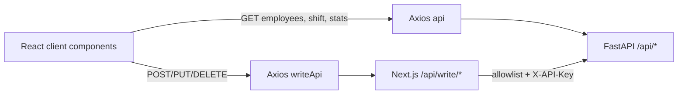
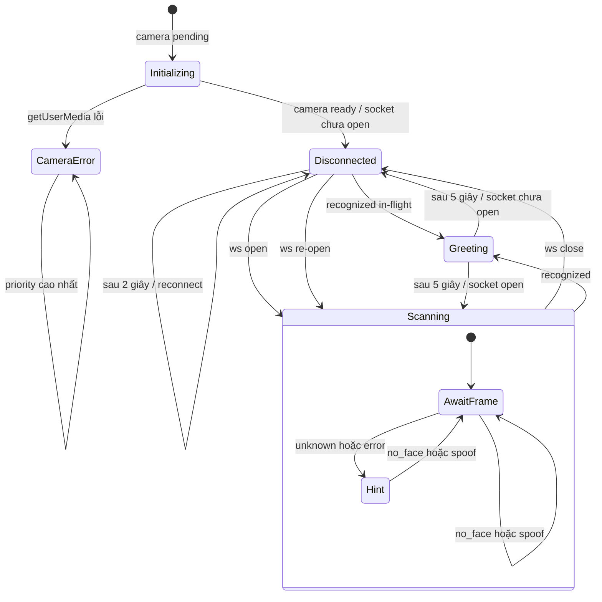

# Chương 6. Frontend dashboard và kiosk

## 6.1. Cấu trúc ứng dụng

Frontend là một ứng dụng Next.js App Router phục vụ hai trải nghiệm:

- **admin dashboard** nằm trong route group `(dashboard)`, dùng chung `AppShell` có sidebar/topbar;
- **kiosk** tại `/kiosk` nằm ngoài route group để dùng toàn màn hình camera, không mang chrome quản trị.

Root layout gắn theme, TanStack React Query, shift settings context và toaster cho toàn ứng dụng. `/` redirect server-side sang `/dashboard`.

```text
app/
├── layout.tsx                    # Providers dùng chung
├── page.tsx                      # / → /dashboard
├── (dashboard)/
│   ├── layout.tsx                # AppShell
│   ├── dashboard/page.tsx        # analytics
│   ├── employees/page.tsx        # list/search/register/delete
│   └── shifts/page.tsx           # shift settings
├── kiosk/page.tsx                # recognition hoặc enrollment theo query
└── api/write/[...path]/route.ts  # BFF allowlist cho write
```

Route group không xuất hiện trong URL. Navigation hiện có ba mục `/dashboard`, `/employees`, `/shifts`; kiosk được mở qua URL trực tiếp hoặc deep-link enrollment, không nằm trong sidebar.

## 6.2. Trang và trách nhiệm

| Route | Thành phần chính | Dữ liệu/tương tác |
|---|---|---|
| `/dashboard` | `DashboardClient` | Gọi summary, monthly, daily thật; chọn năm/tháng; tải Excel. |
| `/employees` | `EmployeesClient` | Tabs danh sách và form mở deep-link đăng ký; list/search đọc trực tiếp, delete qua BFF. |
| `/shifts` | `ShiftSettingsForm` | Dùng context để đọc shift, validate bằng Zod/React Hook Form và cập nhật qua BFF. |
| `/kiosk` | `KioskScreen` | Camera, MediaPipe proximity, WebSocket recognition, shift badge poll 60 giây và TTS. |
| `/kiosk?mode=register&name=...&emp_code=...` | `KioskEnrollment` | Camera + proximity, countdown, burst năm frame, multipart `files`, rồi quay về Employees. |

Query parameter enrollment chỉ truyền tên và mã để điều phối UI; backend vẫn thực hiện validation, unique constraint và trích embedding. Nếu thiếu tên/mã, kiosk hiện lỗi và đưa người dùng về `/employees`.

## 6.3. Data access: read-direct/write-BFF

`frontend/src/lib/api.ts` có hai Axios instance:

- `api` có base URL công khai kết thúc bằng `/api`, dùng cho read trực tiếp tới FastAPI;
- `writeApi` có base URL same-origin `/api/write`, dùng cho write để browser không giữ API key.



Read-direct làm browser cần truy cập được `NEXT_PUBLIC_API_BASE_URL` và phụ thuộc CORS của backend. Write-BFF giữ `API_KEY` ở Node.js runtime, nhưng hiện chỉ allowlist create/delete employee và update shift. Manual attendance writes tồn tại, có auth ở FastAPI, nhưng frontend không có hàm gọi và BFF không expose chúng.

Enrollment tạo `FormData`, append `name`, `emp_code`, rồi append **từng File bằng cùng field `files`**. Đây là multipart multi-file contract thực tế; field số ít `file` trong tài liệu cũ không còn đúng.

## 6.4. React Query, context và cache

Query client mặc định retry một lần, `staleTime=30s` và không refetch khi window focus. Các query key chính:

| Key | Nguồn | Cách làm mới |
|---|---|---|
| `['attendance-summary']` | `/attendance/summary` | Theo lifecycle/stale policy mặc định. |
| `['attendance-monthly', year]` | `/attendance/monthly` | Đổi năm tạo key khác. |
| `['attendance-daily', year, monthName]` | `/attendance/daily` | Đổi năm/tháng tạo key khác. |
| `['employees', page, pageSize]` | `/employees` | Delete hoặc enrollment thành công invalidate prefix `employees`. |
| `['employee-name', searchTerm]` | `/employees/{identifier}` | Delete hoặc enrollment thành công invalidate prefix `employee-name`. |
| `['shift-settings']` tại kiosk | `/shift-settings` | Poll mỗi 60 giây, `staleTime=60s`. |

Shift page không dùng React Query mutation. `ShiftSettingsProvider` đọc localStorage trước rồi gọi API; update thành công cập nhật context và sau hydration ghi lại localStorage. Vì kiosk dùng query riêng và poll, thay đổi ở một tab/thiết bị khác có thể mất tối đa khoảng một chu kỳ 60 giây để hiển thị ở kiosk.

Cache invalidation sau employee create/delete chỉ nhắm danh sách và tìm kiếm employee. Nó không invalidate `attendance-summary`; vì vậy card tổng nhân viên trên dashboard đã mở có thể còn cache đến lần fetch tiếp theo theo lifecycle React Query.

## 6.5. Dashboard analytics

Dashboard không dùng số giả. Ba query gọi:

- `/attendance/summary` cho bốn card Total Employees, Today's Attendance, Average Working Hours, On-Time Rate và delta hôm qua;
- `/attendance/monthly?year=...` cho AreaChart số lượt attendance theo tháng và BarChart tổng giờ;
- `/attendance/daily?year=...&month=...` cho AreaChart giờ trung bình theo ngày.

`available_years` từ API tạo lựa chọn năm; nếu chưa có data client fallback năm hiện tại. Nút Export tạo URL trực tiếp `/attendance/report?year=...&month=...` và để browser tải `.xlsx`. Ba lỗi query được gộp thành một banner “Unable to load dashboard data”; mỗi chart dùng mảng rỗng khi chưa có dữ liệu.

### Giới hạn biểu diễn

- “Today's Attendance” là số **attendance log**, không phải số employee distinct theo schema query hiện tại.
- `on_time_rate` được render trực tiếp với dấu `%`, không format/round thêm ở frontend.
- Trục tháng dùng số 1..12 từ backend; bộ chọn tháng dùng nhãn tiếng Anh `Jan`..`Dec` để suy ra số tháng.
- Download report và các GET analytics là công khai theo backend hiện hành.

## 6.6. Quản lý nhân viên và ca

Trang Employees có hai data path:

1. Khi ô tìm kiếm rỗng, list phân trang theo `page`/`page_size`.
2. Khi có chuỗi, client gọi `/employees/{encodedName}` và chuyển sang page 1 cục bộ.

Delete yêu cầu dialog xác nhận, gọi BFF rồi invalidate list/search. Form đăng ký không upload ngay: nó validate tên/mã, tạo deep-link `/kiosk?mode=register...`; kiosk xin camera, đợi mặt đủ gần, countdown ba giây, chụp burst mục tiêu năm frame cách nhau 400 ms và gửi mảng `files`. Thành công invalidate cache và quay lại `/employees` sau ba giây; lỗi 409 quay về form thay vì retry capture vô hạn.

Trang Shifts validate bốn giá trị time không rỗng. Backend mới là nơi quyết định khung giờ cho attendance; localStorage/context chỉ phục vụ trạng thái giao diện và khả năng hiển thị gần nhất.

## 6.7. Ba lớp trạng thái kiosk

Kiosk recognition phối hợp ba lớp trạng thái độc lập:

1. **Camera:** `pending → ready` hoặc `error` sau `getUserMedia`.
2. **Socket:** `connecting → open → closed → connecting`; reconnect sau 2 giây.
3. **Greeting:** `null → recognized greeting → null`; giữ 5 giây và tạm ngừng capture.

Reducer giữ thêm `hint` và `faceBox`. Hàm `kioskPhase()` không flatten sớm camera/socket/greeting mà suy ra phase render theo priority:

```text
camera_error > recognized > initializing > disconnected > scanning
```

Do đó, lỗi camera luôn che các trạng thái khác; greeting tiếp tục được ưu tiên ngay cả khi socket vừa đóng; socket chỉ tạo overlay disconnected sau khi camera đã ready và không có greeting.



Sơ đồ mô tả phase suy ra, không phải một biến phase được reducer lưu trực tiếp. Camera error không có retry tự động; UI yêu cầu cấp quyền và reload. Socket close/error thì có reconnect timer 2 giây.

## 6.8. Vòng đời camera, socket và frame

Sau khi camera ready, hook mở WebSocket đến `/ws/recognition/{client_id}`. `client_id` ưu tiên query `?client_id=`, nếu không thì dùng UUID lưu trong localStorage. Mỗi giây, khi camera ready, socket open, không có greeting và MediaPipe cho phép, client vẽ video lên canvas, encode JPEG chất lượng 0.7 và gửi binary blob.

MediaPipe chạy phía browser để vẽ bbox và gate người ở đủ gần. Nếu tracker không khởi tạo/inference được, code fail-open cho capture và dùng bbox backend làm fallback. Đây là tối ưu UX/tải, không phải xác thực danh tính hoặc liveness.

Socket handler parse JSON bằng `JSON.parse`; JSON lỗi bị bỏ qua. Sau parse, TypeScript cast sang `RecognitionMessage` nhưng runtime không validate đầy đủ union. Một server/proxy gửi JSON có shape sai có thể đi vào reducer hoặc TTS với field không hợp lệ.

## 6.9. Reducer message và greeting

| Message | Thay đổi state/UI |
|---|---|
| `recognized` | Tạo greeting từ `name` + bản dịch `attendance`, giữ bbox, xóa hint; hook gọi TTS và đặt timer 5 giây. |
| `unknown` | Hint “Không tìm thấy khuôn mặt”, giữ bbox backend. |
| `no_face` | Xóa hint và bbox. |
| `spoof` | Xóa hint và bbox; UI hiện không có cảnh báo spoof riêng. |
| `error` | Hint “Hệ thống đang bận, thử lại sau giây lát”, xóa bbox. |

Khi `state.greeting` tồn tại, reducer bỏ qua toàn bộ message in-flight để kết quả cũ không ghi đè lời chào. `shouldCapture` đồng thời trả false, nên frame mới không được chủ động gửi trong năm giây. Khi timer phát `greeting_done`, greeting, hint và bbox được xóa.

Attendance string và recognition status là hai tầng khác nhau. `recognized` có thể mang “Already checked in”, “Check in not found to check out”, “Not during working hours” hoặc “Lỗi hệ thống”; UI vẫn chào đúng người và dịch lý do nếu biết. Chỉ hai chuỗi success mới chứng minh thao tác chấm công vừa thành công.

## 6.10. TTS best-effort

Khi nhận `recognized`, hook tạo câu `Xin chào {name}. {attendanceMessage}.`, gọi trực tiếp `GET /api/tts?text=...`, tạo object URL từ WAV và phát bằng `Audio`.

TTS là **best-effort**:

- response không thành công thì bỏ qua;
- fetch/synthesis/network exception không đổi kiosk state;
- `audio.play()` bị browser chặn cũng được nuốt lỗi;
- object URL được revoke ở event `ended` hoặc `error`.

Greeting timer không chờ audio kết thúc. Vì vậy overlay vẫn hết sau 5 giây dù audio dài hơn, thất bại hoặc chưa được phát. Nếu message `recognized` in-flight thứ hai đến trước khi reducer state mới được commit, handler vẫn có thể gọi TTS/đặt lại timer vì side effect được quyết định từ message, còn việc bỏ qua nằm trong reducer.

## 6.11. Giới hạn frontend có bằng chứng

- Không có login, session UI hoặc RBAC; dashboard routes không có route guard trong source hiện tại.
- BFF chỉ bảo vệ/forward ba write target; read API, report, TTS và WebSocket đi trực tiếp tới FastAPI theo mức auth đã nêu ở Chương 5.
- WebSocket client không gửi sequence và không nhận acknowledgement; hook không thể phát hiện response thuộc frame nào hoặc loại response out-of-order.
- Parse WebSocket chỉ kiểm tra JSON hợp lệ, không schema-validate union ở runtime.
- Reconnect có delay cố định 2 giây, không exponential backoff/jitter và không có trần retry.
- Camera error không tự retry; kiosk cần reload sau khi sửa quyền/thiết bị.
- Shift context và kiosk query là hai cơ chế cache riêng; consistency giao diện phụ thuộc API fetch/poll, không có push update.
- Employee normalizer chấp nhận một số field legacy (`id`, `empId`, `empCode`) và UI có field department/status không được backend hiện tại trả; giá trị thiếu được fallback khi render.

## 6.12. Kết luận chương

Frontend tổ chức admin dashboard và kiosk trong cùng App Router nhưng tách layout theo mục đích. Dashboard dùng Axios/React Query với stats/report thật; write đi qua BFF allowlist, còn read đi trực tiếp. Kiosk là phối hợp camera, MediaPipe, WebSocket và greeting reducer với priority rõ ràng, reconnect 2 giây, giữ lời chào 5 giây và TTS best-effort. Mô hình này đã nối end-to-end, đồng thời còn các giới hạn xác thực, runtime message validation, correlation frame và cache consistency cần được giữ rõ khi đánh giá hệ thống.

---

[Về mục lục](README.md) · [Trước: Chương 5 — Dữ liệu và API](05-du-lieu-va-api.md) · [Tiếp: Chương 7 — Hạ tầng, bảo mật, hiệu năng và kiểm thử](07-ha-tang-bao-mat-hieu-nang-kiem-thu.md)
