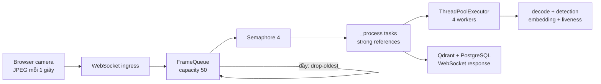
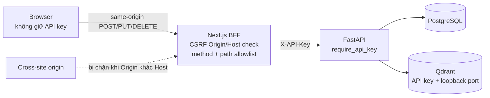

# Chương 7. Hạ tầng, bảo mật, hiệu năng và kiểm thử

## 7.1. Phạm vi và cách đọc

Chương này đánh giá đặc tính vận hành từ code, cấu hình và test tại mốc khảo sát. Các giới hạn hàng đợi, worker hay nhịp gửi frame là **cơ chế đã triển khai**, không phải kết quả benchmark. Repository không cung cấp phép đo đủ để công bố số camera đồng thời tối đa, SLA, latency production hoặc mức sử dụng tài nguyên chuẩn.

Kiến trúc đang chạy vẫn là Next.js cộng một FastAPI **modular monolith**. PostgreSQL và Qdrant chạy trong Docker Compose; API gateway, message broker, recognition worker độc lập và microservice chỉ được trình bày như đề xuất ở Chương 8.

## 7.2. Triển khai hiện tại

### 7.2.1. Process và container

`compose.yaml` chỉ định nghĩa hai container dữ liệu:

| Thành phần | Cách chạy hiện tại | Cấu hình đáng chú ý |
|---|---|---|
| FastAPI/Uvicorn | Host process qua `uv run main.py` hoặc `make run` | `main.py` bind `0.0.0.0:8000` và bật reload; đây là entrypoint phát triển, chưa phải cấu hình process production. |
| Next.js | Host process trong `frontend`, qua `npm run dev`; `npm run build` và `npm run start` phục vụ luồng build/start | Node.js runtime cũng chứa BFF `/api/write/*`. |
| PostgreSQL | Container `postgres:16` | Named volume `pgdata`; init script mount từ `./initdb`; port host `127.0.0.1:${DB_PORT:-5432}`. |
| Qdrant | Container `qdrant/qdrant:v1.18.2` | Image được pin phiên bản; named volume `qdrant_data`; port host `127.0.0.1:${QDRANT_PORT:-6333}`. |

Hai datastore bind vào loopback nên không lộ trực tiếp qua mọi interface của host trong topology Compose hiện tại. Điều đó không tự bảo vệ FastAPI vì entrypoint phát triển bind `0.0.0.0`, cũng không thay thế firewall, network policy, TLS hoặc reverse proxy khi triển khai sang topology khác.

`restart: unless-stopped` giúp hai container dữ liệu tự khởi động lại theo chính sách Docker. Chưa có healthcheck, dependency readiness hay orchestration cho FastAPI/Next.js trong Compose. FastAPI gọi Qdrant khi vào lifespan; lỗi kết nối ở bước này làm startup thất bại thay vì phục vụ với vector store chưa sẵn sàng.

### 7.2.2. Dependency và lệnh vận hành

Backend dùng `uv` với Python 3.11+ và dependency khai báo trong `pyproject.toml`; `make install` chạy `uv sync`, `make db-up`/`db-down` điều khiển Compose, và `make run` chạy ứng dụng. `make db-reset` có bước xác nhận rồi xóa named volumes, do đó là thao tác mất dữ liệu có chủ ý.

Frontend dùng npm và các script `dev`, `build`, `start`, `lint` trong `frontend/package.json`. Source hiện không định nghĩa script `test`; các self-check TypeScript thuần được chạy bằng Node trực tiếp như mô tả ở mục 7.6.

### 7.2.3. Nhóm biến môi trường

Các file `.env.example` chỉ là mẫu; secret thật không được chép vào báo cáo.

| Nhóm | Biến | Vai trò |
|---|---|---|
| PostgreSQL | `DB_NAME`, `DB_USER`, `DB_PASS`, `DB_HOST`, `DB_PORT` | Khởi tạo container và kết nối relational store. |
| Qdrant | `QDRANT_HOST`, `QDRANT_PORT`, `QDRANT_API_KEY`, `QDRANT_HTTPS` | Kết nối vector store, xác thực và lựa chọn HTTP/HTTPS. |
| Backend write auth | `API_KEY` | Secret chia sẻ được FastAPI kiểm tra và BFF gắn vào `X-API-Key`. |
| Môi trường chạy | `ENV` | Với `production`, backend từ chối khởi động nếu liveness vẫn là `PassThroughChecker`. |
| Frontend công khai | `NEXT_PUBLIC_API_BASE_URL` | Base URL REST mà JavaScript browser dùng cho các request đọc. |
| Frontend server-only | `API_KEY`, `BACKEND_INTERNAL_URL` | BFF gọi FastAPI mà không đưa key vào bundle browser. |

Compose yêu cầu `QDRANT_API_KEY` phải có giá trị. Qdrant client truyền key này ở request; `QDRANT_HTTPS=false` phù hợp với Qdrant local dùng plaintext, còn production chỉ nên bật HTTPS khi endpoint phía trước thực sự có TLS. Tiền tố `NEXT_PUBLIC_` tuyệt đối không được dùng cho `API_KEY`.

## 7.3. Concurrency, backpressure và shutdown

### 7.3.1. Đường đi của frame

Browser kiosk chụp và gửi JPEG theo nhịp một giây khi camera, socket và proximity gate cho phép. WebSocket ingress đưa `FrameItem` vào một `FrameQueue(maxsize=50)` dùng chung trong process.

Khi queue đủ 50 item, `put()` lấy bỏ item cũ nhất rồi mới thêm item mới (**drop-oldest**). Đây là backpressure thiên về độ mới của realtime: bộ nhớ chờ không tăng vô hạn và frame cũ được hy sinh. Nó cũng đồng nghĩa frame có thể bị bỏ có chủ ý; queue không có acknowledgement, persistence hay retry sau khi process dừng.



### 7.3.2. Giới hạn tác vụ và event loop

Pipeline dùng `asyncio.Semaphore(4)` để giới hạn tối đa bốn `_process` task in-flight, khớp với `ThreadPoolExecutor(max_workers=4)`. Decode OpenCV, phát hiện/trích embedding và liveness chạy bằng `run_in_executor`, nhờ đó CPU work không thực thi trực tiếp trên event loop. Qdrant, SQLAlchemy async và gửi WebSocket tiếp tục ở luồng async.

Set `_pending_tasks` giữ **strong reference** đến task cho đến callback hoàn tất. Callback xóa reference và trả semaphore permit. Nếu lỗi xảy ra trước khi task được tạo, khối `finally` cũng trả permit, tránh làm cạn semaphore vĩnh viễn.

Các hằng số 50 và 4 là giới hạn triển khai, không phải capacity đã chứng minh. Hiệu năng thực còn phụ thuộc CPU/GPU, model, kích thước frame, số khuôn mặt, Qdrant/PostgreSQL, network và phân bố request. Không thể suy ra “hỗ trợ tối đa N camera” chỉ từ queue, semaphore hoặc thread pool.

### 7.3.3. Graceful shutdown theo nghĩa hiện hành

FastAPI giữ reference đến background pipeline trong `app.state.pipeline_task`. Khi shutdown, lifespan cancel và await pipeline; `run_pipeline()` sau đó cancel toàn bộ child task còn in-flight và `gather(..., return_exceptions=True)`. Chỉ sau khi pipeline task đã kết thúc, app đóng Qdrant client và dispose SQLAlchemy engine.

Đây là shutdown có thứ tự cho pipeline task, Qdrant client và SQLAlchemy engine, nhưng **không phải graceful drain để hoàn tất mọi frame**: child task bị cancel, queue trong RAM không được xử lý hết hay lưu lại. `ThreadPoolExecutor` là biến module-global và FastAPI lifespan không gọi `shutdown()` cho executor này; CPU function đã submit có thể tiếp tục chạy dù `asyncio` task đang await nó đã bị cancel. Cách diễn đạt chính xác là “cancel và await việc kết thúc các asyncio task trước khi đóng datastore client”, không phải “thu hồi toàn bộ execution resource” hay “bảo đảm chấm công in-flight được commit”.

## 7.4. Threat model và ranh giới tin cậy

### 7.4.1. Luồng write qua BFF



Browser là vùng không tin cậy: người dùng có thể sửa request, query, multipart và WebSocket payload. BFF là ranh giới server-side giữ shared secret; FastAPI vẫn phải tự xác thực write thay vì tin BFF tuyệt đối. Tuy nhiên, BFF không xác thực user/session hay gắn identity: caller nào truy cập được một route allowlist đều được proxy gắn shared API key khi gọi backend. PostgreSQL và Qdrant là tài sản chứa dữ liệu nghiệp vụ/sinh trắc; embedding không phải secret đăng nhập nhưng vẫn là dữ liệu nhạy cảm cần kiểm soát vòng đời và quyền truy cập.

### 7.4.2. Kiểm soát đã có

| Kiểm soát | Hành vi có bằng chứng | Phạm vi/giới hạn |
|---|---|---|
| API key fail-closed | Thiếu/rỗng `API_KEY` làm endpoint được bảo vệ trả 503; thiếu/sai header trả 401. | Shared key xác thực caller kỹ thuật, không định danh người dùng. |
| So sánh constant-time | `hmac.compare_digest()` so sánh byte của key. | Không thay thế rotation, scope hay revocation theo người dùng. |
| BFF allowlist | Chỉ forward đúng tổ hợp method/path cho create/delete employee và update shift. | Allowlist giới hạn operation, không xác thực người dùng: caller tới được route hợp lệ sẽ được BFF gắn API key. Manual attendance write có ở backend nhưng chưa được BFF expose. |
| CSRF same-origin | Với request có `Origin`, BFF parse URL và yêu cầu `Origin.host === Host`; khác origin trả 403. | Nhánh này giảm browser CSRF, không chặn direct client. Request thiếu `Origin` được chấp nhận; cần user auth/authorization và cấu hình trusted Host/proxy riêng. |
| Giữ secret server-side | BFF đọc `API_KEY` ở Node.js runtime và chỉ forward một số header cần thiết. | Lộ server env/log hoặc SSR compromise vẫn có thể làm mất key. |
| CORS localhost | FastAPI chỉ cho origin khớp localhost/127.0.0.1, không credentials. | CORS là cơ chế browser, không chặn curl/server-to-server và chưa phải policy production. |
| Qdrant API key | Compose yêu cầu key; client backend gửi key. | Kết nối local mặc định HTTP; cần TLS khi qua mạng không tin cậy. |
| Loopback datastore ports | PostgreSQL/Qdrant chỉ publish trên `127.0.0.1`. | Mất tác dụng nếu đổi bind/topology hoặc attacker đã ở trên host. |
| Production liveness guard | `ENV=production` từ chối `PassThroughChecker`. | Chưa chứng minh model liveness thực đáp ứng FAR/FRR mục tiêu. |

### 7.4.3. Security debt hiện tại

Hệ thống chưa có user login/session, identity provider, RBAC hoặc audit trail cho thao tác quản trị. Vì vậy shared API key không thể trả lời ai đã xóa nhân viên hay đổi ca, cũng không thể cấp quyền khác nhau theo vai trò. Same-origin `Origin`/`Host` check chỉ xử lý một lớp browser CSRF: direct client có thể bỏ `Origin`, và BFF sẽ inject API key cho request tới đúng allowlisted method/path.

Các endpoint GET đọc nhân viên, chấm công, báo cáo và shift; endpoint TTS; cùng WebSocket recognition hiện public theo route dependency hiện hành. CORS localhost không phải lớp auth cho các endpoint đó. WebSocket cũng chưa giới hạn kích thước/tần suất ở application layer, trong khi mỗi frame có thể kích hoạt decode và inference.

Chưa có rate limit, quota theo client/IP, TLS termination, reverse-proxy hardening hay chính sách rotate secret trong source/config khảo sát. BFF giảm rủi ro lộ key và CSRF cho allowlist write, nhưng không biến dashboard thành hệ thống nhiều người dùng an toàn. Production cần TLS cho browser–frontend/API, bảo vệ WebSocket bằng `wss`, và TLS hoặc private network phù hợp cho traffic nội bộ.

## 7.5. Đánh giá hiệu năng có bằng chứng

### 7.5.1. Điều có thể kết luận từ thiết kế

- Queue hữu hạn và drop-oldest kiểm soát độ dài backlog trong một process.
- `Semaphore(4)` kiểm soát số tác vụ in-flight; thread pool bốn worker đưa CPU work khỏi event loop.
- Client capture một giây giảm tần suất đầu vào so với video stream liên tục; proximity gate còn có thể giảm thêm frame khi tracker hoạt động.
- TTS blocking được đưa qua thread bằng `asyncio.to_thread()`; report Excel và các truy vấn khác vẫn cần đo dưới tải thực.
- Queue, connection manager và task set đều nằm trong bộ nhớ process; chạy nhiều Uvicorn process sẽ tạo state riêng, chưa có broker để phân phối/correlation client giữa process.

Các điểm này mô tả cơ chế, không chứng minh throughput, latency hay hiệu quả GPU. Không có kết quả profile/benchmark được Git track trong nhánh khảo sát.

### 7.5.2. Công cụ load test và chỉ số cần đo

Tại thời điểm khảo sát, `scripts/load_test.py` **chỉ có trong working copy gốc và chưa được Git track trên nhánh này**. Vì vậy đây chỉ là công cụ đang có để tham khảo/đo thử, không phải artifact phiên bản hóa và không phải bằng chứng rằng load test đã được chạy hoặc đạt mục tiêu nào.

Công cụ mô phỏng nhiều WebSocket camera, gửi JPEG theo số camera/FPS/thời lượng cấu hình và ghép response với frame pending cũ nhất để ước lượng latency. Nó có thể báo:

- số frame gửi/response nhận và **response rate**;
- latency min/mean/median (**p50**), **p95**, **p99**, max;
- lỗi và phân bố status, throughput tổng; theo từng camera có số sent/received/error cùng latency p50/p95;
- CPU trung bình/đỉnh và RAM RSS trung bình/đỉnh nếu truyền PID server và cài `psutil`.

Phép ghép response với frame cũ nhất chỉ là xấp xỉ vì protocol không có sequence/correlation ID. Frame noise hoặc JPEG 1×1 fallback chủ yếu đo đường `no_face`, không đại diện đầy đủ cho inference khuôn mặt thật, liveness, Qdrant hit và ghi attendance. Muốn dùng kết quả để ra quyết định cần version hóa script, cố định hardware/model/dataset/config, warm-up, lặp lại nhiều lần, lưu raw result và so sánh response rate, p50/p95/p99, CPU, RAM cùng error/status breakdown. Không nên dùng verdict hard-coded trong script để tuyên bố production capacity.

## 7.6. Chiến lược kiểm thử hiện tại

### 7.6.1. Các lớp test có trong source

| Lớp | File tiêu biểu | Điều được kiểm tra |
|---|---|---|
| Unit/pure logic | `tests/platform/test_auth.py`, `test_queue.py`; `tests/modules/attendance/test_schemas.py`; `test_identifier.py`; `test_service.py` của antispoofing | Fail-closed/constant-time auth, drop-oldest, schema, ngưỡng nhận diện, crop/preprocess/liveness abstraction. |
| Service | `tests/modules/attendance/test_service.py`, `employees/test_service.py`, `tts/test_service.py` | Cửa sổ ca và ngày nghiệp vụ, error masking, duplicate/race, thống kê, tạo WAV. Phụ thuộc ngoài chủ yếu được fake/mock. |
| API | `tests/modules/*/test_api.py`, `tests/platform/test_auth.py` | Validation, status/error mapping, multipart, giới hạn upload, dependency API key, endpoint public/protected qua FastAPI `TestClient`. |
| Integration-like trong process | `tests/test_app.py`, `attendance/test_report.py`, `platform/test_qdrant.py`, `tests/scripts/test_reconcile_vectors.py`, `recognition/test_pipeline.py` | Lifespan/shutdown order, workbook hai sheet, cấu hình Qdrant client, đối chiếu drift, concurrency/cancellation pipeline. Đây không phải test với PostgreSQL/Qdrant/network production thật. |
| Frontend pure logic/type contract | `frontend/src/lib/kiosk.test.ts`, `components/kiosk/use-enrollment.test.ts`, `lib/attendance-stats.type-test.ts` | Reducer/phase, URL, proximity, countdown/capture và hợp đồng type analytics. Hai file `.test.ts` là self-check Node; type-test được compiler kiểm tra. |

Không thấy browser E2E, visual regression, benchmark được lưu kết quả, test với database/container thật, test TLS/reverse proxy hay test xác suất trên bộ dữ liệu khuôn mặt/liveness đại diện. Do đó test hiện tại hỗ trợ regression logic và hợp đồng trong process, chưa chứng minh chất lượng AI hoặc độ sẵn sàng production.

### 7.6.2. Lệnh kiểm tra

Backend:

```bash
uv run pytest -q
```

Frontend, chạy trong thư mục `frontend`:

```bash
npm run lint
npx tsc --noEmit
npm run build
node --experimental-strip-types src/lib/kiosk.test.ts
node --experimental-strip-types src/components/kiosk/use-enrollment.test.ts
```

`npm run build` không thay thế hai self-check Node; ngược lại self-check không thay thế lint, typecheck hoặc build. Khi bổ sung CI nên tạo script test frontend chính thức, chạy các tầng độc lập, rồi thêm integration test với service container và browser E2E cho các flow enrollment/recognition/admin quan trọng.

## 7.7. Kết luận chương

Hạ tầng hiện tại phù hợp một deployment phát triển đơn giản: hai datastore container hóa/persist bằng volume, còn FastAPI và Next.js chạy như host process. Pipeline đã có backpressure drop-oldest, giới hạn concurrency, strong-reference task tracking và shutdown có thứ tự. Bảo mật write có fail-closed API key, constant-time compare và BFF allowlist/CSRF guard, nhưng còn khoảng trống lớn ở login, RBAC, audit, rate limit, TLS và các endpoint public. Test hiện tại bao phủ nhiều logic quan trọng; mọi tuyên bố về tải, số camera và chất lượng production vẫn phải chờ benchmark/evaluation có phương pháp.

---

[Về mục lục](README.md) · [Trước: Chương 6 — Frontend dashboard và kiosk](06-frontend-dashboard-va-kiosk.md) · [Tiếp: Chương 8 — Đánh giá và hướng phát triển](08-danh-gia-va-huong-phat-trien.md)
