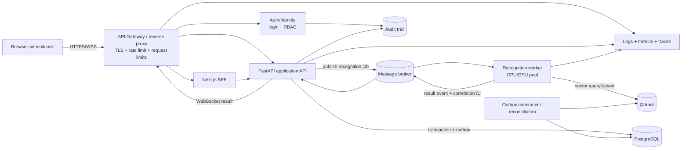

# Chương 8. Đánh giá và hướng phát triển

## 8.1. Nguyên tắc đánh giá

Đánh giá này tách rõ ba loại nhận định: điểm mạnh có code/config/test làm bằng chứng; giới hạn hoặc rủi ro chưa được giải quyết; và ưu tiên phát triển **đề xuất**. Kiến trúc mục tiêu ở cuối chương không phải chức năng đã triển khai. Việc có queue, bốn worker hay một công cụ `load_test` cũng không đủ để công bố capacity, SLA hoặc độ chính xác.

## 8.2. Điểm mạnh đã có

| Điểm mạnh đã triển khai | Bằng chứng hiện trạng | Giá trị |
|---|---|---|
| Modular monolith có ranh giới domain | `employees`, `attendance`, `recognition`, `antispoofing`, `tts` và `platform` được composition tại `src/app.py` | Giữ deployment đơn giản nhưng vẫn có ranh giới để kiểm thử và tách sau này nếu có lý do. |
| Luồng end-to-end thực | Camera kiosk → WebSocket → pipeline → Qdrant → attendance/PostgreSQL → UI/TTS | Hệ thống không chỉ là mockup; các thành phần chính đã được wire. |
| Enrollment không cần train lại classifier | Multi-frame tạo embedding 512 chiều và upsert Qdrant | Thêm nhân viên bằng dữ liệu mới mà không huấn luyện lại toàn bộ mô hình phân loại. |
| Backpressure realtime | Queue 50, drop-oldest, `Semaphore(4)`, thread pool 4 | Giới hạn backlog/tác vụ trong process và ưu tiên frame mới. |
| CPU work rời event loop | Decode/detection/embedding/liveness qua executor | Giảm nguy cơ inference blocking trực tiếp event loop REST/WebSocket. |
| Lifecycle có thứ tự | Startup kiểm tra liveness/collection; shutdown cancel/await pipeline task rồi đóng Qdrant và SQL engine | Thứ tự đóng ba resource này tập trung và có test; module-global thread executor chưa thuộc lifecycle shutdown. |
| Write secret không ở browser | BFF allowlist gắn `X-API-Key`; backend fail-closed và constant-time compare | Giảm bề mặt lộ shared secret trong client bundle; không cung cấp user auth/identity cho caller của BFF. |
| Datastore chuyên biệt và persist | PostgreSQL cho quan hệ, Qdrant cho vector; Compose có named volume và Qdrant image pin | Trách nhiệm dữ liệu rõ, có persistence qua restart container. |
| Guard liveness production | Production từ chối `PassThroughChecker` | Tránh vô tình chạy production với checker luôn trả true. |
| Test regression đa tầng | Unit, service, API, integration-like và frontend pure logic/type checks | Có bằng chứng cho nhiều invariant quan trọng của auth, queue, nghiệp vụ, pipeline và UI logic. |
| Reconciliation read-only | `scripts/reconcile_vectors.py` phát hiện missing/orphan ID, không tự xóa | Hỗ trợ vận hành failure window hai datastore theo hướng an toàn. |

## 8.3. Giới hạn và rủi ro

| Giới hạn/rủi ro hiện tại | Hệ quả | Cách xác nhận/giảm thiểu gần nhất |
|---|---|---|
| Chưa có benchmark tái lập | Không biết response rate, p50/p95/p99, CPU/RAM hay số camera chịu được trên hardware mục tiêu | Version hóa kịch bản, định nghĩa workload và chạy benchmark có raw result; không claim capacity trước đó. |
| Observability mỏng | Khó phân biệt nghẽn inference, queue, Qdrant, DB hay client | Thêm structured log, correlation ID, queue depth/drop counter, latency stage histogram, error/status metrics và trace. |
| Shared API key, không login/RBAC/audit | Không định danh actor, không phân quyền và không truy vết thao tác quản trị | Bổ sung identity/session, RBAC theo action/resource và append-only audit event. |
| BFF allowlisted write không có user auth | Caller truy cập được đúng method/path sẽ được proxy inject API key; không biết caller là ai hay có quyền gì | Đặt authn/authz trước BFF operation và truyền principal đáng tin cậy vào audit/policy. |
| GET, report, TTS và WebSocket public | Có thể đọc dữ liệu hoặc tiêu thụ tài nguyên ngoài ý muốn | Xác định policy từng endpoint, authenticate WebSocket/read, hạn chế payload và quota. |
| Chưa có TLS/rate limit | Nguy cơ nghe lén/key exposure và abuse/DoS | Đặt reverse proxy/API gateway có TLS, `wss`, header policy, body limit và rate limit theo principal/IP. |
| Liveness chưa có đánh giá định lượng | Production guard chỉ bảo đảm không dùng pass-through, không chứng minh chống spoof | Xây dataset/attack protocol và báo cáo APCER/BPCER hoặc metric phù hợp trên môi trường mục tiêu. |
| Hai datastore không atomic | Enrollment/delete có thể tạo missing/orphan vector | Dùng outbox/saga có idempotency, job reconciliation định kỳ và runbook sửa drift. |
| Queue/task state chỉ ở RAM | Restart làm mất frame; scale nhiều process không có phối hợp | Chấp nhận rõ semantics best-effort hiện tại; khi cần scale mới đưa job qua broker/worker. |
| BFF CSRF check chỉ áp dụng khi có `Origin` | Missing `Origin` được chấp nhận; direct client không bị browser same-origin policy ràng buộc | Xem đây là browser CSRF guard, không phải auth; khi có cookie session, thêm CSRF token/SameSite policy và trusted-host/proxy configuration. |
| FastAPI entrypoint bật reload, bind mọi interface | Không phù hợp trực tiếp cho production | Tách cấu hình production với process manager, worker model được benchmark, reverse proxy và network policy. |
| Chưa có healthcheck/readiness orchestration | Service có thể được route traffic trước khi dependency sẵn sàng | Thêm startup/readiness probes kiểm tra dependency theo semantics rõ ràng. |
| Test chưa dùng browser/service thật | Có thể bỏ sót lỗi camera, CORS, proxy, DB/Qdrant và deploy | Thêm container integration, browser E2E và smoke test deployment. |
| WebSocket thiếu schema runtime/correlation ID | Response latency chỉ ghép xấp xỉ; payload sai có thể đi vào reducer | Thêm sequence/frame ID và runtime schema ở cả hai biên. |
| Dữ liệu sinh trắc thiếu governance được mô tả | Rủi ro quyền riêng tư dù ảnh không lưu bền | Định nghĩa consent, mục đích, retention, deletion, encryption/access review cho embedding và audit. |

## 8.4. Ưu tiên phát triển đề xuất

Thứ tự dưới đây cố ý củng cố khả năng đo, kiểm soát truy cập và tính nhất quán trước khi tăng độ phức tạp phân tán.

| Ưu tiên đề xuất | Kết quả cần bàn giao | Tiêu chí hoàn thành gợi ý | Vì sao đứng ở vị trí này |
|---:|---|---|---|
| 1. Benchmark và observability | Workload version hóa; dashboard log/metric/trace; baseline response rate, p50/p95/p99, CPU/RAM, queue drop/depth | Kết quả tái lập trên hardware/model/config ghi rõ; có raw output và không dùng synthetic no-face để đại diện toàn bộ flow | Cần dữ liệu trước khi tối ưu hoặc tách hệ thống. |
| 2. Auth, RBAC và audit | Login/session hoặc OIDC; role/permission; audit actor/action/resource/result | Mọi route quản trị có policy/test; key kỹ thuật không còn đại diện cho người dùng; audit tra cứu được | Khắc phục rủi ro dữ liệu và accountability trực tiếp. |
| 3. TLS và rate limit | HTTPS/WSS, secure headers, trusted proxy/host, body/frame limit, quota | Không truyền secret/plaintext qua mạng không tin cậy; abuse test xác nhận 429/close policy | Tạo biên production an toàn trước khi mở rộng traffic. |
| 4. Validation liveness | Dataset và protocol spoof đại diện; threshold/model governance | Báo cáo metric, false accept/reject và điều kiện test; production model artifact được version hóa | Guard hiện tại mới loại pass-through, chưa chứng minh chất lượng. |
| 5. Outbox và reconciliation | Durable intent cho ghi chéo kho, idempotent consumer/retry; reconciliation định kỳ | Fault-injection ở từng bước không mất dấu intent; drift được phát hiện/cảnh báo và sửa theo runbook | Giảm failure window PostgreSQL–Qdrant trước khi phân tán thêm. |
| 6. GPU worker và message broker | Recognition job contract, broker, worker pool, result correlation/cancellation | Benchmark chứng minh bottleneck và lợi ích; có backpressure, retry/dead-letter/idempotency, observability | Chỉ thêm khi inference/resource isolation thực sự cần scale độc lập. |
| 7. Cân nhắc microservice | ADR dựa trên tải, ownership, release cadence và fault isolation | Có ranh giới dữ liệu/API, SLO, contract test, deployment/rollback và đội sở hữu rõ | Microservice là lựa chọn cuối, không phải mục tiêu tự thân. |

### 8.4.1. Giai đoạn 1 — Đo được hệ thống

Trước hết cần đưa `scripts/load_test.py` hoặc một harness thay thế vào Git sau review. Ở mốc khảo sát, file này chỉ có trong working copy gốc và chưa được Git track trên nhánh, nên không có kết quả nào từ nó được coi là bằng chứng. Harness cần phát workload riêng cho `no_face`, unknown, recognized + DB write và liveness; gắn sequence ID để đo chính xác; ghi hardware, model/provider, số camera, FPS, frame size, duration, warm-up và version commit.

Song song, instrument từng stage: thời gian chờ queue, số drop-oldest, decode/detection/liveness/embedding, Qdrant query, attendance transaction và WebSocket send. Từ đó mới xác định bottleneck nằm ở CPU/GPU, store hay protocol, thay vì suy đoán từ `Semaphore(4)`.

### 8.4.2. Giai đoạn 2 — Tạo biên tin cậy production

Thêm identity cho người quản trị, policy RBAC và audit trail trước khi mở rộng BFF. Hiện tại BFF inject shared key cho mọi caller tới được một allowlisted write; `Origin` khác `Host` chỉ bị chặn khi header `Origin` tồn tại, nên guard này xử lý browser CSRF chứ không xác thực direct client. Browser session nên dùng cookie an toàn, `SameSite` phù hợp và CSRF protection đầy đủ; service-to-service credential tách khỏi user identity. Reverse proxy/API gateway terminate TLS, nâng WebSocket thành `wss`, enforce trusted host, body/frame limit và rate limit. Endpoint read, report, TTS và recognition WebSocket cần policy explicit thay vì public theo mặc định.

### 8.4.3. Giai đoạn 3 — Chứng minh AI và nhất quán dữ liệu

Liveness phải được đánh giá bằng dữ liệu/kiểu tấn công phù hợp, không chỉ bằng việc model load được. Với PostgreSQL–Qdrant, nên ghi durable outbox trong transaction PostgreSQL, consumer thực hiện operation Qdrant idempotent, và reconciliation kiểm tra hậu điều kiện. Thiết kế phải xử lý cả enrollment lẫn delete, retry sau crash và orphan/missing vector mà không tự động xóa dữ liệu mơ hồ.

### 8.4.4. Giai đoạn 4 — Chỉ tách compute khi số đo yêu cầu

Nếu profiling cho thấy inference cần GPU isolation hoặc scale khác REST, recognition pipeline có thể trở thành worker nhận job qua broker. Broker không nên chỉ thay `asyncio.Queue`: cần contract version, correlation ID, freshness/deadline, at-most/at-least-once semantics, idempotency, dead-letter và cách trả kết quả đúng WebSocket client.

Sau bước đó mới đánh giá microservice cho auth, recognition hoặc reporting. Nếu modular monolith vẫn đáp ứng SLO và một đội cùng sở hữu/release, giữ monolith có thể là lựa chọn ít rủi ro hơn.

## 8.5. Kiến trúc mục tiêu — đề xuất, chưa triển khai

> **Nhãn trạng thái:** Toàn bộ sơ đồ này là kiến trúc mục tiêu đề xuất. `compose.yaml` và source hiện tại chưa có API gateway/auth service, message broker, recognition worker độc lập, GPU autoscaling hay audit store riêng.

Trong mục tiêu này, gateway là biên TLS/rate limit chứ không thay auth nghiệp vụ; auth cung cấp principal/role; FastAPI giữ orchestration nghiệp vụ; recognition worker sở hữu compute AI; broker tách nhịp nhận request khỏi inference; outbox/reconciliation bảo vệ intent qua hai store. Mỗi mũi tên mới cũng tạo chi phí vận hành, failure mode và yêu cầu observability/contract test mới, nên sơ đồ chỉ nên được hiện thực hóa theo từng bằng chứng bottleneck hoặc ownership.

## 8.6. Kế hoạch đánh giá sau cải tiến

| Trục đánh giá | Chỉ số/bằng chứng | Điều kiện báo cáo |
|---|---|---|
| Hiệu năng | response rate, p50/p95/p99 end-to-end và theo stage, throughput, queue depth/drop, CPU/GPU/RAM | Công bố hardware, model, workload, thời lượng, raw result và số lần lặp. |
| Recognition | tỷ lệ nhận đúng/sai, unknown, false accept/reject theo cohort/điều kiện | Dataset có consent, split rõ, không dùng dữ liệu train làm test. |
| Liveness | attack/bonafide error metric theo loại spoof | Ghi thiết bị, ánh sáng, kiểu tấn công và threshold. |
| Tin cậy | startup/reconnect, dependency outage, crash giữa PG–Qdrant, retry/idempotency | Fault-injection và runbook khôi phục có kết quả mong đợi. |
| Bảo mật | authz matrix, CSRF, rate limit, TLS scan, secret rotation, audit completeness | Test negative path và review threat model sau mỗi thay đổi biên. |
| UX kiosk | thời gian từ đứng đúng vị trí đến feedback, tỷ lệ retry, camera permission/reconnect | Đo trên thiết bị/browser mục tiêu, tách latency kỹ thuật và trải nghiệm. |

Kết quả chỉ nên được so sánh khi cùng workload và điều kiện. “Không lỗi trong một lần chạy” không chứng minh SLO; verdict của một script không thay acceptance criteria định lượng và phân tích raw data.

## 8.7. Kết luận chương

FaceVec Attend có nền tảng hợp lý cho đồ án và một deployment quy mô nhỏ chưa được định lượng: modular monolith rõ domain, luồng kiosk end-to-end, vector search chuyên biệt, backpressure hữu hạn, BFF giữ secret và test regression đa tầng. Rủi ro ưu tiên không phải “chưa dùng microservice”, mà là chưa có benchmark/observability, identity–RBAC–audit, TLS/rate limit, đánh giá liveness và cơ chế nhất quán bền vững giữa hai store. Roadmap vì thế đo và harden trước, thêm outbox/reconciliation tiếp theo, chỉ tách GPU worker/broker và microservice khi số liệu cùng ranh giới ownership chứng minh nhu cầu.

---

[Về mục lục](README.md) · [Trước: Chương 7 — Hạ tầng, bảo mật, hiệu năng và kiểm thử](07-ha-tang-bao-mat-hieu-nang-kiem-thu.md) · [Tiếp: Chương 9 — Phụ lục tra cứu](09-phu-luc-tra-cuu.md)
